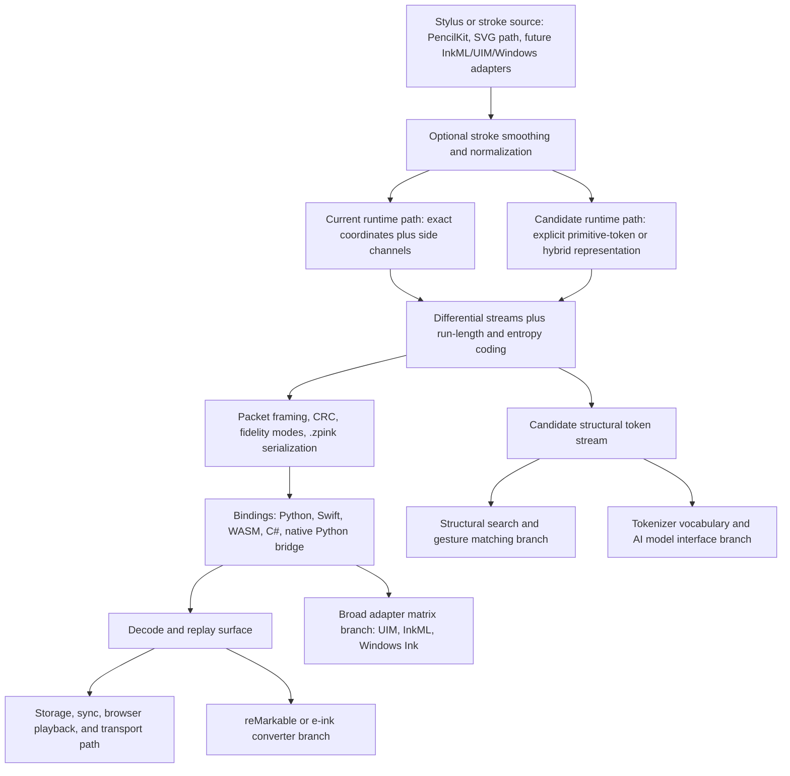

# ZPE-Digital-Ink - ZER0PA Innovation PRD
Sector: Digital Ink
Sector Folder: /Users/Zer0pa/ZPE/Zer0pa PRD & Research/Digital Ink/
Document Class: SECTOR_SPECIFIC_PRD
Version: 0.3.0
Created: 2026-03-20
Last Modified: 2026-03-20
Status: CONCEPT / FIRST_LANE_FREEZE_ACTIVE
PRD Class: IMMUTABLE_CHARTER + MUTABLE_EXPERIMENT_PROGRAM
Source Corpus: /Users/Zer0pa/ZPE/Zer0pa PRD & Research/Digital Ink/output/source_coverage_matrix.md
Authority Metric: AM-INK-01 - structured-ink codec authority metric with non-compensatory transport gates
Comparator State: L1_FROZEN / L2+ OPEN
PRD Hash: UNRATIFIED

<!-- HISTORY
[2026-03-20] v0.0.0 -> v0.1.0: First canonical concept-stage Digital Ink PRD assembled from the extractor surface, control docs, targeted source rereads, staged-repo truth, local package and proof checks, and curated proof artifacts. No sovereign authority metric, comparator set, dataset suite, runtime-identity closure, commercialization wedge, license posture, or public-claim threshold is frozen yet. Local codec/package/parity evidence is real, but release readiness remains inconclusive because the staged proof bundle contains a PASS scorecard and a NO-GO handoff manifest at the same time.
[2026-03-20] v0.1.0 -> v0.1.1: Verifier pass repaired source-provenance drift around the runbook surface and restored the fuller canonical evidence and state-artifact contract in Sections 4.4, 8.1, and 11. Sovereign authority metric, comparator set, dataset suite, runtime-identity closure, commercialization wedge, license posture, and public-claim threshold remain unfrozen.
[2026-03-20] v0.1.1 -> v0.3.0: Refiner pass froze the first-lane Digital Ink execution surface without weakening gates: `AM-INK-01`, comparator and byte-accounting rules, dataset order and claim-family mapping, exact-coordinate runtime identity, `8`-direction default policy, codec-first technical artifact, tokenizer-first commercial wedge, current SAL execution posture, and the no-public-promotion threshold. The staged PASS-versus-NO-GO contradiction remains open, but it is now frozen as a P6 release blocker rather than a reason to keep the whole lane strategically ambiguous.
-->

Charter split note:
- Provisional immutable charter surface for concept stage: Sections 0-3, 5, 7, 10, 14, 15, 15A-15E, and 16.
- Mutable experiment program surface: Sections 4, 6, 8, 9, 11, 12, and 13.
- Concept-stage first-lane boundary: `zpe_ink` as a deterministic `.zpink` stroke codec and transport layer, backed by exact roundtrip, side-channel preservation, cross-runtime parity, packaging sanity, and benchmark/falsification artifacts in the staged repo. Explicit primitive-token runtime, AI-tokenizer standardization, structural search, reMarkable interoperability, and broad adapter completion remain explicit candidate or maximalization surfaces rather than silently deleted scope.

## 1. Mission and Structural Thesis

### 1.1 One-Sentence Mission
Ship ZPE-Digital-Ink first as a deterministic `.zpink` codec and transport substrate that proves structured-ink advantage, exact roundtrip or declared fidelity, and cross-runtime parity on a frozen benchmark pack, while keeping tokenizer, search, reMarkable-interoperability, and broad-adapter branches explicit rather than blending them into fake first-lane closure.

Parallel source mission candidates that remain active:
- M-01: cross-platform compression and encoding layer between stylus APIs and storage or sync.
- M-02: deterministic transport and interchange substrate under note apps, whiteboards, and pen-sync systems.
- M-03: structurally searchable stroke representation that supports token-level search, similarity, and gesture matching.
- M-04: standard tokenizer or `BPE/SentencePiece` layer for ink-native AI systems.
- M-05: interoperability and export wedge for e-ink devices such as reMarkable, Boox, and Supernote.

### 1.2 Structural Thesis
Source-grounded thesis surface:
- EXPLICIT / DI-01: a pen stroke is naturally a directional sequence in `2D`, so the domain is closer to a primitive basis than many other sectors.
- EXPLICIT / DI-01: pressure, tilt, and azimuth are structured scalar side channels rather than arbitrary semantic baggage.
- EXPLICIT / DI-01 plus DI-03: structured strokes appear to contain meaningful directional redundancy, which is why smoothing, differential encoding, coarse directional quantization, and entropy coding are repeatedly proposed as a winning stack.
- EXPLICIT / DI-02: the structural appeal is strongest today on synthetic or bounded structured-stroke surfaces, not yet as a universal runtime truth over arbitrary handwriting.
- EXPLICIT / DI-03: the maximal brief pushes the claim to its strongest form, namely that strokes are not merely compatible with the primitive basis but are the primitive basis.
- EXPLICIT / DI-04: the strongest convergent external-validation logic is not generic file compression but direction-based tokenization as a useful representation for ink AI.
- EXPLICIT / DI-04: the hard-corpus weakness is not framed as a small bug; it is framed as evidence that arbitrary handwriting may already sit near the entropy ceiling for a coarse direction alphabet.

Cross-source synthesis kept visible as inference:
- INFERENCE: the strongest stable structural reading is not "Digital Ink is already a solved primitive-token kernel," but "Digital Ink is one of the strongest candidate domains for a primitive-backed deterministic representation, provided the runtime and benchmark surfaces are made honest."
- INFERENCE: the current source set supports two structurally coherent futures at once: a deterministic codec and transport substrate under existing stacks, and a standard token vocabulary for ink-native AI. The corpus does not yet justify collapsing those into one frozen product identity.

### 1.3 Falsification Condition
Source-grounded falsification envelope:
- EXPLICIT / CTRL plus DI-02 plus DI-04: if same-corpus comparison against frozen raw and modern comparators shows no meaningful advantage even on structured directional ink, the narrow codec thesis weakens materially.
- EXPLICIT / DI-02 plus DI-03 plus DI-04: if the runtime remains exact-coordinate delta/RLE forever and never closes a clearer primitive-token or hybrid-runtime story, the strongest "strokes are the primitives" thesis remains unratified.
- EXPLICIT / DI-02 plus DI-04: if hard public corpora continue to compress only marginally and that weakness proves structural rather than tactical, broad arbitrary-handwriting compression claims should be abandoned rather than euphemized.
- EXPLICIT / DI-04: if cross-platform parity and fragmentation do not correspond to real adoption pull, the transport/interchange wedge remains technically real but commercially weak.
- EXPLICIT / DI-04: if tokenizer standardization cannot show measurable downstream value, distribution pull, or real model-interface relevance, the AI-tokenizer thesis remains strategically attractive but operationally unclosed.
- EXPLICIT / DI-04: if `8` directions cannot preserve required fidelity in the most important target surfaces, the canonical primitive-resolution claim weakens and a `16`-direction or configurable family becomes necessary.

Operationalized concept-stage pivot rule (INFERENCE; verifier attack required):
- Narrow the first-lane story to structured-ink transport if broad handwriting compression does not survive same-dataset scrutiny.
- Keep primitive-token serialization, AI-tokenizer standardization, structural search, and reMarkable interoperability as separate candidate programs until each carries its own evidence burden.
- Do not narrate local package sanity, staged proof passes, or private staging success into public-readiness closure while the repo still carries an explicit NO-GO release artifact.

### 1.4 Agent-Readable Brief
ZPE-Digital-Ink is now a concept-stage PRD with a frozen first-lane boundary, not just an open blocker list. The narrow reality is real: the current repo contains a deterministic `.zpink` stroke codec with fidelity modes, side-channel preservation, CRC, cross-runtime decode surfaces, local package tests, roundtrip verification, parity verification, a wheel build, and a curated proof bundle. The frozen first technical artifact is the codec package plus `.zpink` contract. The frozen first commercial wedge is tokenizer infrastructure built on top of that substrate, not because tokenizer authority is already proven, but because DI-04 makes it the strongest strategic distribution path. The narrow reality is still incomplete: the evaluator says the runtime is closer to an exact-coordinate delta/RLE codec than a true primitive-token kernel, hard public-style corpora are weak compared with the concept's `5-10x` rhetoric, and release readiness remains inconclusive because the staged bundle contains both PASS and NO-GO surfaces.

### 1.5 Superordinate Goal
First-lane execution priority:
- SG-01 plus SG-03 hybrid: establish `.zpink` as a deterministic stroke transport substrate with real codec authority first, then use that substrate to support stronger tokenizer, search, and interop branches.

Wider source-consistent superordinate-goal candidates remain active:
- SG-01: prove a deterministic stroke codec and transport layer that achieves `>=5x` compression versus raw float32 storage on frozen structured-ink surfaces while preserving exact roundtrip or declared fidelity floors.
- SG-02: become the first credible standard tokenizer for digital ink AI, with a stable token vocabulary and reusable pre-tokenized corpora.
- SG-03: establish a structurally searchable stroke substrate that supports similarity, gesture matching, and compressed-space operations without full decode.
- SG-04: become a cross-runtime open representation layer beneath note, whiteboard, and stylus ecosystems.
- SG-05: create the highest-leverage interoperability bridge for e-ink devices by compressing, converting, and exporting rich stroke data.
- SG-06: preserve a path to a broader platform-standard or acquisition surface if the narrow technical lane survives hard comparator scrutiny.

## 2. Scope and Boundaries

### 2.1 In-Scope Artifacts
| Artifact | Type | Lane | Target Path | State |
|----------|------|------|-------------|-------|
| `zpe_ink` codec package | code | L1 | /Users/Zer0pa/ZPE/ZPE Ink/ZPE-Ink/code/zpe_ink/ | PRIMARY_FIRST_LANE |
| `.zpink` packet contract and binding surface | code + format | L1 | /Users/Zer0pa/ZPE/ZPE Ink/ZPE-Ink/code/ | PRIMARY_FIRST_LANE |
| benchmark and falsification harness | code + proof | L1 | /Users/Zer0pa/ZPE/ZPE Ink/ZPE-Ink/code/scripts/ and /Users/Zer0pa/ZPE/ZPE Ink/ZPE-Ink/proofs/curated_artifacts/2026-02-20_zpe_ink_wave1/ | PRIMARY_FIRST_LANE |
| cross-runtime parity surface | proof | L1 | /Users/Zer0pa/ZPE/ZPE Ink/ZPE-Ink/proofs/curated_artifacts/2026-02-20_zpe_ink_wave1/ink_cross_runtime_parity.json | PRIMARY_FIRST_LANE |
| wheel and packaging surface | packaging | L1 | /Users/Zer0pa/ZPE/ZPE Ink/ZPE-Ink/code/pyproject.toml | PRIMARY_FIRST_LANE |
| browser or WASM decode surface | code | L1 | /Users/Zer0pa/ZPE/ZPE Ink/ZPE-Ink/code/bindings/wasm/ | FIRST_LANE_EXTENSION |
| structural-search demo | demo | L2 | /Users/Zer0pa/ZPE/Zer0pa PRD & Research/Digital Ink/artifacts/structural-search-demo/ | CANDIDATE |
| tokenizer vocabulary spec and pre-tokenized corpora | spec + dataset | L2 | /Users/Zer0pa/ZPE/Zer0pa PRD & Research/Digital Ink/artifacts/ink-tokenizer-pack/ | STRATEGIC_CANDIDATE |
| reMarkable or e-ink conversion tool | tool | L3 | /Users/Zer0pa/ZPE/Zer0pa PRD & Research/Digital Ink/artifacts/eink-converter/ | PRESERVED_WEDGE |
| broad adapter matrix for PencilKit, Wacom UIM, InkML, Windows Ink, and SVG | integration | L3 | /Users/Zer0pa/ZPE/Zer0pa PRD & Research/Digital Ink/artifacts/adapter-matrix/ | CHALLENGED_CANDIDATE |

### 2.2 Out-of-Scope (Explicit)
- Rendering engines, handwriting recognition models, note-taking applications, or general sketching products.
- Silent promotion of the current exact-coordinate runtime into an explicit proven primitive-token kernel.
- Broad public claims that ZPE Ink is already a universal replacement for platform-native ink formats or open standards.
- Treating adapter count as equivalent to product pull.
- Treating structural-search capability as equivalent to search demand.
- Treating a staged private repo push as equivalent to blind-clone or public-release closure.
- Writing any Digital Ink drafting artifact outside `/Users/Zer0pa/ZPE/Zer0pa PRD & Research/Digital Ink/`.

### 2.3 Sector Boundary and Document Locality
- Sector-specific PRDs, research notes, output artifacts, and drafting records live inside `/Users/Zer0pa/ZPE/Zer0pa PRD & Research/Digital Ink/`.
- The actual working code repo for this sector is `/Users/Zer0pa/ZPE/ZPE Ink/ZPE-Ink/`. Repo truth is admissible evidence, but it does not move sector-local PRD artifacts out of the sector folder.
- Root-level docs remain reserved for sector-agnostic canon, methodology, alignment briefs, and cross-sector orchestration doctrine.
- Sibling sector folders are read-only unless an explicit cross-sector integration phase is declared.

### 2.4 Source Corpus and Coverage Matrix
| Source ID | Path | Type | Required For | Status | Notes |
|-----------|------|------|--------------|--------|-------|
| CTRL-01 | /Users/Zer0pa/ZPE/Zer0pa PRD & Research/ZER0PA_SCIENTIFIC_METHODOLOGY.md | control doc | 1, 4, 5, 6, 7, 10, 11, 13, 14, 15 | VERIFIED | Governing no-theater, authority-first, falsification-first method. |
| CTRL-02 | /Users/Zer0pa/ZPE/Zer0pa PRD & Research/PRD_ALIGNMENT_BRIEF_2026-03-09.md | control doc | 4, 5, 7, 8, 9, 11, 12, 14 | VERIFIED | Defines charter-vs-program split and sidecar doctrine. |
| CTRL-03 | /Users/Zer0pa/ZPE/Zer0pa PRD & Research/ZER0PA Innovation PRD — Canonical Format Specification.md | control doc | 0 through 16 | VERIFIED | Canonical PRD schema. |
| DI-01 | /Users/Zer0pa/ZPE/Zer0pa PRD & Research/Digital Ink/ZPE Digital Ink — Concept Document v1.0.md | concept | 1, 2, 3, 5, 6, 7, 13 | VERIFIED | Broad codec-first and adapter-first thesis. |
| DI-02 | /Users/Zer0pa/ZPE/Zer0pa PRD & Research/Digital Ink/EXTERNAL_EVALUATION_SUMMARY_2026-03-09.md | evaluation | 1, 2, 5, 7, 10, 11, 14 | VERIFIED | Runtime-identity caution and `YELLOW` maturity verdict. |
| DI-03 | /Users/Zer0pa/ZPE/Zer0pa PRD & Research/Digital Ink/Digital Ink Maximal Brief.md | maximal brief | 1, 3, 4, 5, 13, 14 | VERIFIED | Preserves the broad platform and search ambition. |
| DI-04 | /Users/Zer0pa/ZPE/Zer0pa PRD & Research/Digital Ink/ZPE-ink Cllaud e POV.md | strategy reframing | 1, 3, 4, 5, 7, 13, 14, 15A | VERIFIED | AI-tokenizer, QuickDraw, and reMarkable-first pressure. |
| REPO-01 | /Users/Zer0pa/ZPE/ZPE Ink/ORIENTATION_REPORT_2026-03-09.md | repo audit | 2, 4, 11, 14 | VERIFIED | Historical repo-boundary and test-status truth. |
| REPO-02 | /Users/Zer0pa/ZPE/ZPE Ink/REPO_HARDENING_REPORT_2026-03-09.md | repo audit | 2, 11, 14 | VERIFIED | Staged repo creation and unresolved proof contradiction. |
| REPO-03 | /Users/Zer0pa/ZPE/ZPE Ink/PRIVATE_STAGING_REPORT_2026-03-09.md | repo audit | 11, 14 | VERIFIED | Private remote push succeeded; public readiness did not close. |
| REPO-04 | /Users/Zer0pa/ZPE/ZPE Ink/ZPE-Ink/README.md | repo readme | 2, 9, 11, 14 | VERIFIED | Current staged-repo quickstart and readiness wording. |
| REPO-05 | /Users/Zer0pa/ZPE/ZPE Ink/ZPE-Ink/PUBLIC_AUDIT_LIMITS.md | repo audit | 11, 14 | VERIFIED | Explicitly blocks over-reading staged-repo truth. |
| REPO-06 | /Users/Zer0pa/ZPE/ZPE Ink/ZPE-Ink/code/README.md | code readme | 2, 3, 9, 11 | VERIFIED | Runtime package surface and scripts. |
| REPO-07 | /Users/Zer0pa/ZPE/ZPE Ink/ZPE-Ink/code/pyproject.toml | package manifest | 3, 11, 15E | VERIFIED | Current package boundary and active license string. |
| REPO-08 | /Users/Zer0pa/ZPE/ZPE Ink/ZPE-Ink/proofs/runbooks/RUNBOOK_ZPE_INK_MASTER.md | repo runbook | 4, 8, 9, 10, 11 | VERIFIED | Active local runbook surface inside the staged repo boundary. |
| PROOF-01 | /Users/Zer0pa/ZPE/ZPE Ink/ZPE-Ink/proofs/INK_WAVE1_RELEASE_READINESS_REPORT.md | proof audit | 4, 11, 14 | VERIFIED | Summarizes the PASS-versus-NO-GO contradiction. |
| PROOF-02 | /Users/Zer0pa/ZPE/ZPE Ink/ZPE-Ink/proofs/curated_artifacts/2026-02-20_zpe_ink_wave1/ | proof bundle | 4, 5, 6, 10, 11, 14, 15B, 15C | VERIFIED | Core metric, parity, falsification, and readiness artifacts. |

### 2.5 Lane Boundaries
| Lane ID | Name | Owner Agent(s) | Folder Boundary | Integration Phase |
|---------|------|----------------|-----------------|-------------------|
| L1 | Deterministic codec and transport core | execution-agent:TBD | /Users/Zer0pa/ZPE/ZPE Ink/ZPE-Ink/code/ and /Users/Zer0pa/ZPE/ZPE Ink/ZPE-Ink/proofs/ | P2-P4 |
| L2 | Tokenizer, search, and dataset-standardization branch | execution-agent:TBD | /Users/Zer0pa/ZPE/Zer0pa PRD & Research/Digital Ink/artifacts/ink-tokenizer-pack/ | P4-P5 |
| L3 | Interop and commercialization wedge branch | execution-agent:TBD | /Users/Zer0pa/ZPE/Zer0pa PRD & Research/Digital Ink/artifacts/ | P5-P6 |

### 2.6 Anti-Scope-Creep Rule
Lane boundaries are strict until an explicit integration phase is declared.
- Compression, fidelity, latency, parity, search novelty, tokenizer relevance, and commercialization potential may not be averaged into one pseudo-metric.
- Broad adapter scope may not silently become first-lane responsibility because it sounds complete.
- The tokenizer wedge may not erase the codec truth; the codec truth may not erase the tokenizer opportunity.
- Any public-facing claim that exceeds the current evidence surface triggers a PRD amendment, not a wording tweak.

## 3. Architecture and Component Decisions

### 3.1 System Architecture
This diagram preserves current codec truth while keeping the explicit primitive-token, search, tokenizer, and interoperability branches visible.

Architecture interpretation:
- Source-stable current runtime: deterministic exact-coordinate stroke codec with delta-like streams, side-channel preservation, CRC, fidelity modes, and multi-runtime decode surfaces.
- Source-live but unclosed theory path: explicit primitive-token or hybrid runtime still needs direct implementation and benchmark truth.
- Source-live second-order value path: structural search and AI-tokenization are downstream branches of the same representation family, but they do not inherit closure automatically from codec proofs.
- Source-live commercialization branch: interoperability and e-ink conversion remain meaningful adjacent wedges, but not source-closed first-lane obligations.

### 3.2 Component Selection
| Component | Choice | License | Rationale | Alternative Evaluated | State |
|-----------|--------|---------|-----------|----------------------|-------|
| Runtime identity | Current exact-coordinate deterministic codec with declared future primitive-token repair path | current repo under SAL surface | Matches evaluator and repo truth without deleting the primitive thesis | Pretend current repo already serializes a pure primitive lattice | FROZEN_CURRENT_RUNTIME_V1 |
| Primitive alphabet | `8` directions as the current canonical tokenizer thesis, with `16` or configurable variants preserved as challenger branches | unresolved | Strongest current structural thesis across concept and evaluator, while preserving resolution-challenge pressure | Commit immediately to `16` or silently ignore the warning | FROZEN_V1_DEFAULT_WITH_CHALLENGER_BRANCH |
| Smoothing stage | `ink-stroke-modeler`-style presmoothing before encoding | third-party licensing unresolved | Explicit concept dependency and quality-improvement lever | No smoothing or bespoke smoothing only | SOURCE_STABLE_WITH_LICENSE_OPEN |
| Encoding stack | smoothing -> differential or delta-like streams -> coarse directional quantization candidate -> side-channel encoding -> entropy coding -> packet framing | mixed | Most coherent union of concept, maximal brief, and current implementation truth | Learned neural compression core | MIXED_REALITY |
| Side-channel handling | Preserve `pressure`, `tilt`, and `azimuth` as structured channels | current repo and concept both support it | Side-channel fidelity is a hard differentiator | Drop side channels for easier compression | SOURCE_STABLE |
| Fidelity envelope | `lossless`, `high`, `medium`, `sketch` modes | current repo and concept align here | Keeps transport and storage flexibility explicit | Single mode only | SOURCE_STABLE |
| Determinism and debug surface | deterministic output plus human-readable debug JSON | current repo plus concept | Supports replay, inspection, and provenance claims | Opaque adaptive codec only | SOURCE_STABLE |
| Packet contract | `.zpink`, magic `ZPINK`, version `1` in current readiness contract | current repo package surface under SAL | Strongest current interchange artifact | UIM-wrapped first format or format-in-name-only | LOCAL_TRUTH_ONLY |
| Browser surface | WASM decoder and browser playback path | current repo binding surface | Supports the concept's browser thesis with real code presence | Browser omitted | SOURCE_STABLE |
| Search engine | Token or pattern search over compressed representations | unresolved | Strong capability family with no settled demand | OCR-first or decompression-only search | CANDIDATE |
| Token vocabulary | explicit stable token IDs, possibly `8 x 8 = 64`, with hybrid or expanded alphabet preserved | unresolved | Necessary if AI-tokenizer wedge becomes primary | Leave token vocabulary informal | OPEN |
| Adapter strategy | Narrow first, broad later: keep broad matrix visible but defer most adapters until after a first wedge freezes | mixed | Best fit to concept breadth plus Claude narrowing | Build all adapters now or cut them all forever | FROZEN_FIRST_WEDGE_DISCIPLINE |
| Wacom UIM position | meaningful standards bridge candidate, but not a settled first adapter | third-party ecosystem terms apply | Preserves the concept path without overstating leverage | Treat Wacom as mandatory now or kill it completely | OPEN_TENSION |
| Implementation substrate | current checked-in Python package plus native and runtime bindings; concept still points to shared Rust core | mixed | Preserves repo truth and concept ambition simultaneously | Claim Rust-first closure from the current repo | MIXED_REALITY |
| License posture | current repo truth is SAL v6-style source-available licensing; permissive-core and standardization-friendly alternatives remain open strategic options | `LicenseRef-Zer0pa-SAL-6.0` in current manifest | Honest current legal truth without deleting future licensing alternatives | Pretend MIT core is already the active repo reality | FROZEN_CURRENT_EXECUTION_POSTURE |

### 3.3 Environment Doctrine
| Environment | Use Case | Required Controls |
|-------------|----------|-------------------|
| local CPU package environment | codec tests, roundtrip checks, latency, wheel build, benchmark scripts, local replay | fixed interpreter, command log, seed capture, artifact paths |
| cross-runtime binding environment | Python, WASM, Swift, C#, and native-bridge parity checks | identical input fixtures, hash comparison, contract file |
| browser or WASM runtime | playback and decode proof, future demo surface | same packet fixtures, bundle hash, explicit browser target |
| public benchmark host | QuickDraw, MathWriting, IAM, CROHME, and later corpora | dataset seal, comparator freeze, exact byte-accounting rules |
| device or ecosystem host | PencilKit, Windows Ink, reMarkable, Boox, Supernote, or other adapter-specific work | format samples, export contracts, device-version capture |

Environment note:
- The narrow codec thesis is already provable on CPU and binding surfaces; it does not require a heavy accelerator stack.
- The broader adapter and e-ink wedges require real ecosystem artifacts, not only synthetic or package-level replay.

### 3.3A Environment Authority Freeze Surface
| Claim family | Minimum authority environment candidate | Comparator or support environment candidate | Stretch environment candidate | Freeze State |
|--------------|----------------------------------------|--------------------------------------------|-------------------------------|--------------|
| codec roundtrip, fidelity, and latency | local CPU package environment plus project venv | clean second local env for replay sanity | none required | FROZEN_LOCAL_V1 |
| cross-runtime parity | Python plus WASM plus Swift plus C# plus native bridge | browser target for decode parity | none required | FROZEN_LOCAL_V1 |
| hard-corpus benchmark authority | frozen public dataset host with same-corpus comparators | independent rerun or blind-clone host | none declared | FROZEN_REQUIRED_FOR_PUBLIC_AUTHORITY |
| tokenizer and structural-search authority | QuickDraw and MathWriting benchmark host | HuggingFace or model-integration environment | none declared | FROZEN_REQUIRED_FOR_WEDGE_PROMOTION |
| e-ink or platform interop authority | real device or export-sample environment | desktop conversion host | browser or mobile review host | UNFROZEN |

Freeze rule:
- Local codec and parity surfaces are evidentially real but still local.
- The current first-lane metric may rely on local codec and parity surfaces.
- No public or commercialization-bound claim may be promoted until the relevant non-local environment row is frozen.

### 3.4 Dependency and License Constraints
- `ink-stroke-modeler` remains a real dependency candidate, but redistribution and commercial bundling posture are explicitly still open.
- Current repo truth is SAL-like source-available licensing, not MIT-core or permissive-open-standard closure, and that current posture is now frozen as the active execution reality until an explicit amendment changes it.
- Standardization ambition and restrictive functional-equivalence language may pull in opposite directions.
- InkML, UIM, ISF, platform-native formats, and learned stroke tokenizers are comparator or interop surfaces, not implicit proof that ZPE wins.
- Public benchmark and redistribution plans must respect each dataset's license and redistribution terms before any HuggingFace or public-corpus release.
- If the first wedge becomes tokenizer infrastructure, token vocabulary, dataset redistribution, and standardization licensing need to be designed together rather than retrofitted.

### 3.5 Delivery Form Factor and Adoption Surface
| Form Factor | Primary User | Integration Mode | Commercial Reason | Evidence Needed | State |
|-------------|--------------|------------------|-------------------|-----------------|-------|
| `zpe_ink` codec package | developers handling stroke storage, sync, or interchange | drop-in library beneath existing capture APIs | Narrowest current technical identity with real local proof | exact roundtrip, fidelity, latency, parity, package install, comparator freeze | FROZEN_FIRST_TECHNICAL_ARTIFACT |
| `.zpink` packet format | tool builders and ecosystem integrators | interchange or transport contract | portable deterministic ink artifact is a real differentiator | explicit spec, version stability, parity, adapter truth | FROZEN_FIRST_TECHNICAL_ARTIFACT |
| pip-installable tokenizer package | AI or data infra teams | preprocessing or tokenization layer | strongest strategic wedge in DI-04 | stable token vocabulary, dataset release, benchmark tasks, adoption metric | FROZEN_FIRST_COMMERCIAL_WEDGE |
| structural-search demo | sketch, symbol, or gesture-system builders | demo or sidecar service | capability-positive second-order moat | query quality, query latency, real user problem | PRESERVED_BRANCH |
| reMarkable or e-ink converter | e-ink power users and tool builders | converter and export utility | strongest non-AI wedge in the updated POV | real device samples, conversion fidelity, community pull | PRESERVED_NON_AI_WEDGE |
| broad adapter SDK | note-app, stylus, and platform vendors | multi-platform integration kit | preserves the maximal platform-standard ambition | adapter completeness, maintenance plan, real partner demand | LATER_BRANCH_ONLY |

### 3.5A Commercialization Wedge and De-Risking Sequence
Frozen v1 split between technical artifact and commercial wedge:
- WEDGE-01: codec package plus `.zpink` contract is the frozen first technical artifact and authority-bearing substrate.
- WEDGE-02: tokenizer package and token vocabulary infrastructure is the frozen first commercial wedge, but it does not replace the sovereign codec metric.
- WEDGE-03: QuickDraw remains the preferred public demo and distribution surface once the public-claim gate is cleared.
- WEDGE-04: MathWriting plus the hard-corpus honesty tier remain the science-repair surface that decides whether the structured-ink specialization is strong enough to widen.
- WEDGE-05: reMarkable or e-ink interoperability remains the strongest non-AI adjacent wedge.
- WEDGE-06: broad adapter or standards bridge remains later expansion, not first-lane closure.

De-risking rule:
- Do not let broad SDK rhetoric outrun the first wedge.
- Do not let the tokenizer wedge erase the codec proof path or vice versa.
- Do not treat fragmentation as evidence of demand; prove the integration surface that actually matters.
- Do not let the frozen commercial wedge redefine the sovereign technical metric by implication.

## 4. Phase Plan and Execution Gates

### 4.1 Phase Sequence
| Phase | Name | Objective | Entry Gate | Exit Gate | Status |
|-------|------|-----------|------------|-----------|--------|
| P0 | Concept and evidence synthesis | convert the extractor surface plus repo truth into a canonical PRD without deleting contradictions | extractor pack complete | draft PRD plus provenance packet complete | PASS |
| P1 | Authority and comparator freeze | freeze the sovereign metric, comparator family, dataset order, runtime-identity statement, first wedge, current execution license posture, and public-claim boundary | P0 exit | FZ-01 through FZ-08 complete; FZ-09 explicitly carried into release staging | PASS |
| P2 | Deterministic codec core | maintain and verify exact roundtrip, fidelity, latency, package installability, and packet contract | staged repo exists | local package and proof surfaces pass | PASS |
| P3 | Hard-corpus and runtime-identity repair | rerun real corpora, fix metric framing, and close or formally defer primitive-token runtime | P2 exit | hard-corpus truth and runtime truth no longer conflict with public language | BLOCKED |
| P4 | Candidate-program execution | run tokenizer, QuickDraw, structural-search, hybrid-coding, and reMarkable branches under explicit candidate rules | P1 freeze or explicit provisional candidate authorization | one branch earns promotion or falsification | IN_PROGRESS |
| P5 | Integration and parity expansion | extend beyond current binding parity into selected adapters or outward demo surfaces | P2 exit | chosen integration surface survives same-truth checks | IN_PROGRESS |
| P6 | Release staging and blind-clone verification | resolve PASS-versus-NO-GO contradiction, run cold-clone proof, and produce a clean release verdict | P3 and P5 exit | contradiction-free GO or explicit FAIL | FAIL |

### 4.1A Active Candidate Program Families
| Candidate Family | Active Hypothesis Families | Current Role |
|------------------|----------------------------|--------------|
| CF-01 Deterministic codec and transport core | HF-01, HF-02, HF-05, HF-06, HF-07, HF-20, HF-24 | first-lane technical boundary |
| CF-02 Broad SDK and adapter matrix | HF-03, HF-08, HF-12 | preserved maximal breadth candidate |
| CF-03 Narrow tokenizer-first product | HF-04, HF-14, HF-15, HF-21 | strongest commercialization reframing |
| CF-04 Structural search and compressed-space operations | HF-10, HF-11, HF-16 | capability-positive but demand-open branch |
| CF-05 Hard-corpus repair and hybrid coding | HF-06, HF-17, HF-22, HF-23 | technical salvage and science-closure branch |
| CF-06 Standards and licensing leverage | HF-08, HF-09, HF-12, HF-13, HF-24 | adoption-path and legal-tension branch |
| CF-07 e-ink and reMarkable interoperability | HF-18, HF-19 | strongest non-AI adjacent wedge |
| CF-08 First-lane closure discipline | HF-24 | control family that prevents metric and wedge blending |

### 4.1B Candidate Program Operating Contract
| Candidate Family | First Artifact | First Proof | First Kill or Narrow Condition | Current State |
|------------------|----------------|------------|-------------------------------|---------------|
| CF-01 | reproducible codec benchmark and package surface | roundtrip, fidelity, latency, parity, same-baseline byte counts | narrow to structured-ink only if hard-corpus claim fails | ACTIVE |
| CF-02 | one selected adapter beyond current bindings | same-truth parity plus real user pull | demote if adapter work expands faster than evidence or demand | ACTIVE_BUT_DEFERRED |
| CF-03 | pip tokenizer plus frozen token vocabulary note | QuickDraw and MathWriting token outputs plus downstream utility metric definition | demote if no concrete authority metric emerges beyond rhetoric | ACTIVE |
| CF-04 | structural-search demo over a frozen corpus | query latency and retrieval-quality evidence | demote if only novelty, no user problem | ACTIVE |
| CF-05 | hybrid or context-adaptive coding branch | same-corpus improvement on hard data without breaking determinism | kill if improvement is trivial or erases the representation thesis | ACTIVE |
| CF-06 | explicit license and standards memo | adoption analysis plus legal consistency | narrow if standardization ambition and active license remain incompatible | ACTIVE |
| CF-07 | reMarkable or e-ink converter prototype | conversion fidelity plus community demand signal | demote if interop pain is weaker than claimed | ACTIVE |

### 4.2 Gate Execution Rules
- Gates execute in order. No skipped gate may be retroactively narrated as passed.
- If a gate fails: stop blind retries, diagnose, research on failure if needed, amend runbook or design, apply minimal justified fix, rerun the failed gate, then rerun downstream gates that depend on it.
- Phase status values remain: NOT_STARTED | IN_PROGRESS | PASS | FAIL | BLOCKED | PAUSED_EXTERNAL.

### 4.2A Candidate State Transition Rules
- `ACTIVE -> PROMOTED` requires a concrete artifact, a frozen metric for that family, and no hidden contradiction with Sections 5, 7, or 14.
- `ACTIVE -> NARROWED` is the default when the evidence survives only on structured surfaces or only for a smaller user problem.
- `ACTIVE -> MAXIMALIZATION_ONLY` applies when a branch remains promising but would force a different authority metric, dataset suite, or delivery surface than the first lane.
- `ACTIVE -> FALSIFIED` requires same-corpus same-comparator failure, not mere lack of time.

### 4.3 Phase Status Log
| Date | Phase | Gate | Result | Evidence Path | Agent | Notes |
|------|-------|------|--------|---------------|-------|-------|
| 2026-03-20 | P0 | canonical draft assembly | PASS | /Users/Zer0pa/ZPE/Zer0pa PRD & Research/Digital Ink/PRD_ZPE_DIGITAL_INK.md | A-DRAFT | First Digital Ink PRD created from extractor pack plus repo truth. |
| 2026-03-20 | P2 | package test surface | PASS | /Users/Zer0pa/ZPE/ZPE Ink/ZPE-Ink/code/tests/test_codec_roundtrip.py | A-DRAFT | `pytest code/tests -q` passed locally in the project venv. |
| 2026-03-20 | P2 | roundtrip smoke | PASS | /Users/Zer0pa/ZPE/ZPE Ink/ZPE-Ink/executable/verify_roundtrip.py | A-DRAFT | local verifier reported `roundtrip_ok`. |
| 2026-03-20 | P5 | cross-runtime parity | PASS | /Users/Zer0pa/ZPE/ZPE Ink/ZPE-Ink/executable/verify_cross_runtime.py | A-DRAFT | local contract and parity check passed across declared runtimes. |
| 2026-03-20 | P2 | package build sanity | PASS | /Users/Zer0pa/ZPE/ZPE Ink/ZPE-Ink/code/pyproject.toml | A-DRAFT | wheel build succeeded locally. |
| 2026-03-20 | P6 | release-readiness adjudication | FAIL | /Users/Zer0pa/ZPE/ZPE Ink/ZPE-Ink/proofs/INK_WAVE1_RELEASE_READINESS_REPORT.md | historical + A-DRAFT review | proof bundle remains inconclusive because PASS scorecard and NO-GO handoff coexist. |
| 2026-03-20 | P1 | first-lane freeze package | PASS | /Users/Zer0pa/ZPE/Zer0pa PRD & Research/Digital Ink/output/authority_metric_freeze.md | A-REFINE | AM-INK-01, comparator rules, dataset mapping, runtime identity, wedge split, current SAL posture, and no-public-promotion threshold frozen. |

### 4.4 Startup Control Artifacts
| Artifact | Role | Current State | Target Path |
|----------|------|---------------|-------------|
| `output/charter_lock.md` | charter freeze record | PRESENT | /Users/Zer0pa/ZPE/Zer0pa PRD & Research/Digital Ink/output/charter_lock.md |
| `output/experiment_program.md` | mutable candidate-program control plane | PRESENT | /Users/Zer0pa/ZPE/Zer0pa PRD & Research/Digital Ink/output/experiment_program.md |
| `output/source_coverage_matrix.md` | extractor source coverage | PRESENT | /Users/Zer0pa/ZPE/Zer0pa PRD & Research/Digital Ink/output/source_coverage_matrix.md |
| `output/sector_manifest.md` | sector-local manifest | PRESENT | /Users/Zer0pa/ZPE/Zer0pa PRD & Research/Digital Ink/output/sector_manifest.md |
| `output/research_pack_index.md` | required read-pack index | PRESENT | /Users/Zer0pa/ZPE/Zer0pa PRD & Research/Digital Ink/output/research_pack_index.md |
| `output/state.json` | execution state sidecar | PRESENT | /Users/Zer0pa/ZPE/Zer0pa PRD & Research/Digital Ink/output/state.json |
| `output/budget_status.json` | budget and resource sidecar | PRESENT | /Users/Zer0pa/ZPE/Zer0pa PRD & Research/Digital Ink/output/budget_status.json |
| `output/best_known_state.json` | current best metric snapshot | PRESENT | /Users/Zer0pa/ZPE/Zer0pa PRD & Research/Digital Ink/output/best_known_state.json |
| `output/candidate_registry.json` | candidate family tracker | PRESENT | /Users/Zer0pa/ZPE/Zer0pa PRD & Research/Digital Ink/output/candidate_registry.json |
| `output/event_log.ndjson` | append-only execution log | PRESENT | /Users/Zer0pa/ZPE/Zer0pa PRD & Research/Digital Ink/output/event_log.ndjson |

### 4.5 Ratification Freeze Package
| Freeze ID | Item To Freeze | Why It Matters | Current State |
|-----------|----------------|----------------|---------------|
| FZ-01 | sovereign authority metric | prevents blended pass narratives | CLOSED_AM-INK-01 |
| FZ-02 | comparator family and byte-accounting method | prevents baseline slippage | CLOSED_L1_BYTE_ACCOUNTING |
| FZ-03 | dataset order and claim-family dataset mapping | prevents favorable-dataset cherry-picking | CLOSED_V1_CLAIM_FAMILY_MAPPING |
| FZ-04 | runtime-identity statement | stops primitive-theory overclaim | CLOSED_CURRENT_RUNTIME_V1 |
| FZ-05 | first-lane product and commercialization wedge | stops codec/tokenizer/search/adapter blending | CLOSED_SPLIT_TECHNICAL_AND_COMMERCIAL |
| FZ-06 | token vocabulary and primitive-resolution policy | required if tokenizer path becomes sovereign | CLOSED_V1_DEFAULT_AND_BRANCH_RULE |
| FZ-07 | current execution license posture and release boundary | standardization and adoption depend on honest legal reality | CLOSED_CURRENT_SAL_POSTURE |
| FZ-08 | public-claim threshold | blocks premature external narrative | CLOSED_NO_PUBLIC_PROMOTION |
| FZ-09 | release-readiness contradiction repair | PASS and NO-GO cannot coexist at ratification | FAILING |

## 5. Acceptance Criteria and Thresholds

### 5.1 Authority Metric
| Metric ID | Metric | Threshold | Measurement Method | Current Value | Freeze State |
|-----------|--------|-----------|--------------------|---------------|--------------|
| AM-INK-01 | structured-ink codec authority with non-compensatory transport gates | `>=5x` versus frozen raw float32 primary baseline on the structured-ink tier, plus exact roundtrip or declared fidelity floors, plus parity pass | same-corpus byte-count ratio with frozen byte-accounting rules plus Sections 5.2 transport gates | `5.5902x` overall on the current structured or proxy pack, with roundtrip PASS and parity PASS | SOVEREIGN_FROZEN |
| AM-INK-02 | hard-corpus public authority | same-corpus honest performance on MathWriting, CROHME, IAM, and UNIPEN with frozen comparators and no blended structured-tier rescue | public benchmark reruns under the frozen mapping in Section 7.1A | current evidence is mixed, with `1.0944x` MathWriting and `1.3015x` CROHME; IAM and UNIPEN public closure remain open | FUTURE_PROMOTION_GATE |
| AM-INK-03 | tokenizer infrastructure authority | measurable downstream model, dataset, or adoption advantage from deterministic ink tokens | frozen token vocabulary plus downstream task or adoption metric | no frozen measurement yet | FUTURE_PROMOTION_GATE |
| AM-INK-04 | structural-search authority | query quality and latency advantage over decompressed or non-token baselines on frozen corpora | retrieval benchmark and user-task framing | no frozen measurement yet | FUTURE_PROMOTION_GATE |
| AM-INK-05 | interoperability authority | deterministic identical decode across declared runtimes plus verified ecosystem interchange | parity contract plus adapter proof | local cross-runtime parity passes; ecosystem interop not frozen | NON_COMPENSATORY_SUPPORT_GATE |

### 5.1A Authority Metric Selection Rule
- AM-INK-01 is the frozen sovereign metric for the v1 first lane.
- AM-INK-05 remains a non-compensatory support gate for transport and portability claims.
- AM-INK-02 is the required promotion gate if the lane wants public scientific authority rather than structured-tier local codec authority.
- AM-INK-03 becomes sovereign only if the lane explicitly amends into a tokenizer-first execution lane.

### 5.2 Secondary Metrics
| Metric | Threshold | Weight | Measurement | Current Local Value | Notes |
|--------|-----------|--------|-------------|---------------------|-------|
| exact roundtrip | bit-exact in lossless mode | non-compensatory if AM-INK-01 is chosen | packet encode/decode comparison | PASS | verified locally and in the proof bundle |
| visual fidelity | Hausdorff `<=1px` at `96 DPI` | non-compensatory if lossy path is claimed | metric file and render comparison | `0.0` max Hausdorff in current local proof | current proof does not settle all downstream-task equivalence |
| pressure fidelity | RMSE `<=2%` | non-compensatory when pressure is claimed | pressure metrics artifact | `0.0` max RMSE percent in current local proof | side-channel preservation is a real differentiator |
| encode latency | `<=2 ms` per stroke | important but not sovereign by itself | latency benchmark | median `0.8175 ms`, p95 `0.9369 ms` in current local proof | local host only |
| cross-runtime parity | identical decode across declared runtimes | non-compensatory when parity is claimed | parity contract and hash checks | PASS | current local truth only |
| hard-corpus compression | avoid fake universality | informational until AM-INK-02 is frozen | MathWriting and CROHME reruns | `1.0944x` and `1.3015x` | strongest current honesty constraint |
| bits-per-point narrative | consistent reporting discipline | informational | benchmark reporting convention | not frozen | may need to accompany compression ratio |
| search latency and quality | problem-specific threshold TBD | informational | future search benchmark | NOT_STARTED | demand not yet frozen |
| tokenizer adoption or utility | task-specific threshold TBD | informational unless AM-INK-03 is chosen | downstream task or adoption measure | NOT_STARTED | strongest strategic wedge still lacks a gate |

### 5.3 Threshold Amendment Protocol
Any threshold change after baseline freeze:
1. Requires explicit PRD amendment with justification.
2. Makes prior results provisional until rerun.
3. Must be committed, not silently applied.
4. Must preserve the old threshold in the history block and freeze notes.

## 6. Falsification Protocol

### 6.1 Destruct Test Battery
| DT ID | Test | Current Result | Evidence | Why It Matters |
|-------|------|----------------|----------|----------------|
| DT-INK-01 | lossless roundtrip on canonical fixtures | PASS | /Users/Zer0pa/ZPE/ZPE Ink/ZPE-Ink/proofs/curated_artifacts/2026-02-20_zpe_ink_wave1/ink_roundtrip_results.json | proves the narrow codec is not vapor |
| DT-INK-02 | compression threshold on current structured or proxy benchmark pack | PASS_LOCAL_ONLY | /Users/Zer0pa/ZPE/ZPE Ink/ZPE-Ink/proofs/curated_artifacts/2026-02-20_zpe_ink_wave1/ink_compression_benchmark.json | strongest current performance-positive artifact |
| DT-INK-03 | visual fidelity threshold | PASS_LOCAL_ONLY | /Users/Zer0pa/ZPE/ZPE Ink/ZPE-Ink/proofs/curated_artifacts/2026-02-20_zpe_ink_wave1/ink_fidelity_metrics.json | preserves the codec story from collapsing into lossy shorthand |
| DT-INK-04 | pressure fidelity threshold | PASS_LOCAL_ONLY | /Users/Zer0pa/ZPE/ZPE Ink/ZPE-Ink/proofs/curated_artifacts/2026-02-20_zpe_ink_wave1/ink_pressure_metrics.json | verifies structured side-channel preservation |
| DT-INK-05 | encode latency threshold | PASS_LOCAL_ONLY | /Users/Zer0pa/ZPE/ZPE Ink/ZPE-Ink/proofs/curated_artifacts/2026-02-20_zpe_ink_wave1/ink_latency_benchmark.json | keeps the codec operational rather than archival |
| DT-INK-06 | cross-runtime decode parity | PASS_LOCAL_ONLY | /Users/Zer0pa/ZPE/ZPE Ink/ZPE-Ink/proofs/curated_artifacts/2026-02-20_zpe_ink_wave1/ink_cross_runtime_parity.json | supports the transport and portability thesis |
| DT-INK-07 | hard-corpus non-inferiority and honest scope test | FAIL_OPEN | /Users/Zer0pa/ZPE/ZPE Ink/ZPE-Ink/proofs/curated_artifacts/2026-02-20_zpe_ink_wave1/maximalization_gate_results.json | blocks universal handwriting compression language |
| DT-INK-08 | explicit primitive-token or hybrid-runtime equivalence test | NOT_STARTED | no artifact yet | closes the runtime-identity gap if it ever passes |
| DT-INK-09 | blind-clone and contradiction-free release package | FAIL | /Users/Zer0pa/ZPE/ZPE Ink/ZPE-Ink/proofs/INK_WAVE1_RELEASE_READINESS_REPORT.md | blocks public-readiness narration |

### 6.2 Domain-Specific Kill Gates and Proposed Ratification Gates
| Gate ID | Gate Type | Condition | Current State | Notes |
|---------|-----------|-----------|---------------|-------|
| KG-INK-01 | ACTIVE_RATIFICATION_GATE | if AM-INK-01 is chosen, same-corpus structured-ink compression must stay above threshold together with exact roundtrip or declared fidelity floors | FROZEN_AND_LOCALLY_SATISFIED | local proof is strong on the frozen structured tier; public authority is still separate |
| KG-INK-02 | ACTIVE_BLOCKER | arbitrary-handwriting or universal-compression claims are blocked until DT-INK-07 closes on frozen public corpora | ACTIVE | this is the main honesty gate from DI-02 and DI-04 |
| KG-INK-03 | ACTIVE_BLOCKER | primitive-token kernel language is blocked until DT-INK-08 exists and passes | ACTIVE | current runtime truth is exact-coordinate codec |
| KG-INK-04 | PROPOSED_RATIFICATION_GATE | broad adapter or standards narratives may not become first-lane closure until the primary wedge and demand surface are frozen | OPEN | prevents adapter sprawl from masquerading as traction |
| KG-INK-05 | PROPOSED_RATIFICATION_GATE | tokenizer-first promotion requires a stable token-vocabulary spec, a frozen adoption or utility metric, and at least one reusable corpus surface | OPEN | strongest strategy branch still lacks an authority package |
| KG-INK-06 | ACTIVE_BLOCKER | public release language is blocked while PASS scorecards and NO-GO handoff artifacts coexist | ACTIVE | local repo truth is still contradictory |

### 6.3 Falsification Evidence Log
| Date | Test or Gate | Result | Evidence Path | Notes |
|------|--------------|--------|---------------|-------|
| 2026-02-20 | DT-INK-01 through DT-INK-06 local proof bundle | PASS_LOCAL_ONLY | /Users/Zer0pa/ZPE/ZPE Ink/ZPE-Ink/proofs/curated_artifacts/2026-02-20_zpe_ink_wave1/ | positive local codec evidence exists |
| 2026-02-20 | DT-INK-07 hard-corpus truth surface | FAIL_OPEN | /Users/Zer0pa/ZPE/ZPE Ink/ZPE-Ink/proofs/curated_artifacts/2026-02-20_zpe_ink_wave1/maximalization_gate_results.json | MathWriting and CROHME do not support generic `5x` language |
| 2026-03-09 | DT-INK-09 release-readiness adjudication | FAIL | /Users/Zer0pa/ZPE/ZPE Ink/ZPE-Ink/proofs/INK_WAVE1_RELEASE_READINESS_REPORT.md | staged repo is not public-ready |
| 2026-03-20 | local rerun of package, roundtrip, parity, and wheel build | PASS_LOCAL_ONLY | /Users/Zer0pa/ZPE/ZPE Ink/ZPE-Ink/ | confirms the repo is runnable; does not repair public-readiness gaps |

## 7. Baseline Discipline

### 7.1 Frozen Baselines
| Baseline Family | Description | Current State | Why It Matters |
|-----------------|-------------|---------------|----------------|
| raw float32 coordinate pairs | concept's main compression baseline | FROZEN_PRIMARY_BASELINE_V1 | AM-INK-01 depends on it directly |
| raw int16 or compact coordinate baseline | alternative numeric-storage baseline reported beside the primary baseline | FROZEN_SECONDARY_DISCIPLINE | prevents favorable numeric-baseline slippage |
| gzip, zstd, protobuf or protobuf+gzip | basic engineering comparators | FROZEN_ENGINEERING_COMPARATORS_V1 | required for same-corpus engineering credibility |
| Microsoft ISF | incumbent-format challenger | FROZEN_NAMED_INCUMBENT_CHALLENGER | strongest named incumbent-risk family |
| UIM and InkML | standards and interop challengers | FROZEN_CONTEXT_OR_INTEROP_REFERENCES | remain required for standards language, but not current sovereign metric rows |
| learned stroke tokenizers or compression models | AI-era comparator family | OPEN_FUTURE_TOKENIZER_COMPARATOR_FAMILY | important if tokenizer wedge is promoted beyond strategy |
| current exact-coordinate codec | runtime-truth anchor | FROZEN_RUNTIME_TRUTH | prevents theory claims from erasing actual implementation identity |

### 7.1A Dataset Freeze Candidates by Claim Family
| Claim Family | Dataset Candidates | Priority | Freeze State | Notes |
|--------------|-------------------|----------|--------------|-------|
| Quick public demo and tokenizer distribution | QuickDraw | FIRST | FROZEN_DEMO_AND_TOKENIZER_SURFACE | strongest demo and adoption surface, but not enough for universal authority alone |
| structured-ink proving ground | MathWriting | FIRST | FROZEN_STRUCTURED_AUTHORITY_TIER | best place to test geometric-strength claims honestly |
| academic credibility and handwriting realism | IAM On-Line | SECOND | FROZEN_HARD_CORPUS_HONESTY_TIER | concept gives it top authority; public closure still pending |
| notation-heavy stress surface | CROHME | SECOND | FROZEN_HARD_CORPUS_HONESTY_TIER | current weak result makes it scientifically important |
| cross-script authority | UNIPEN | SECOND | FROZEN_HARD_CORPUS_HONESTY_TIER | important for multilingual or cross-script claims |
| later expansion corpora | CASIA-OLHWDB, HOMUS | LATER | OPEN | kept visible, not first-cycle mandatory |
| e-ink or device interop surfaces | reMarkable and related export corpora | LATER | OPEN | needed only if e-ink wedge is promoted |

### 7.2 Comparator Rules
- Every headline result must name the exact raw float32 bytes, exact encoded bytes, bytes per point where relevant, exact side-channel accounting, and exact dataset split.
- L1 comparator rows must report at minimum: raw float32 baseline, raw int16 or compact numeric baseline if available, gzip or zstd engineering baseline, and Microsoft ISF where technically feasible on the same corpus.
- UIM and InkML remain context or interoperability comparators until they have same-corpus evidence.
- Public authority claims require same-corpus comparison across the frozen comparator family and any learned-token comparator family being invoked.
- Proxy, synthetic, and structured-only corpora must be labeled as such at the metric row, not only in a footnote.
- ISF, UIM, InkML, and platform-native formats may not be invoked rhetorically without actual benchmark or integration evidence.
- Tokenizer metrics and codec metrics must not be merged unless one explicitly frozen authority metric demands both.

### 7.3 Survivor Selection Protocol
- If only the structured-ink compression story survives, narrate that narrower truth and stop implying arbitrary-handwriting superiority.
- If the tokenizer path becomes the strongest science and adoption surface, promote it explicitly instead of keeping it as subtext beneath a weak transport story.
- If no branch survives a frozen metric and comparator pack, keep the lane in concept-stage research rather than manufacturing a release narrative.
- If one branch requires a new sovereign metric, new dataset suite, or new license model, treat it as a candidate-family promotion or split-lane event.

## 8. PRD Generation Quartet and Agent Governance

### 8.1 PRD Generation Quartet
| Role | Current Status | Output |
|------|----------------|--------|
| Extractor | COMPLETE | source coverage matrix, atomic units, hypothesis registry, contradiction register, open questions, writer handoff pack |
| Drafter | COMPLETE_THIS_TURN | canonical Digital Ink PRD plus provenance packet |
| Verifier | COMPLETE_THIS_PASS | verifier findings, source-support audit, coverage audit |
| Augmenter-Refiner | COMPLETE_THIS_PASS | corrected and expanded post-verifier draft plus freeze and handoff artifacts |

### 8.2 Quartet Handoff Contract
- The verifier must attack every place where the draft narrows the lane around the codec core.
- The verifier must attack any wording that implies the current runtime already closes the primitive-token thesis.
- The verifier must attack any section that softens the `PASS` versus `NO-GO` release contradiction.
- The verifier must attack any place where QuickDraw, tokenizer, search, or reMarkable branches were made too small or too large relative to source support.

### 8.3 Downstream Execution Topology
- Default topology remains minimal: one orchestrator plus one execution agent at a time unless candidate families become truly independent.
- CF-01 and CF-05 can share a core-codec execution context because hybrid coding and hard-corpus repair touch the same truth surface.
- CF-03, CF-04, and CF-07 can become parallel only after P1 freezes the sovereign metric and the first product identity.

### 8.4 Agent Operating Contract
- Evidence outranks prose.
- A technically narrower but evidence-true claim outranks a broader but fragile one.
- Candidate programs stay explicit until falsified or promoted.
- The active repo may be runnable and still not be release-ready.
- Sector-folder outputs remain the source of truth for the PRD-generation workflow.

### 8.5 Orchestrator Rules
- The top acceptance gate is sovereign.
- Any regression on the chosen authority metric is failure, regardless of side wins.
- Do not optimize for a narratable win over the governing objective.
- Focus on code quality, benchmark quality, and science quality; do not generate administrative theater as a substitute for closure.
- Keep docs and handover artifacts stable until the real gate is met; do not use a better-looking summary to erase a mixed evidence surface.

### 8.6 Independent Verification Roles (when applicable)
| Role | Responsibility |
|------|----------------|
| metric verifier | confirm authority metric, baseline, and byte-accounting discipline |
| runtime verifier | confirm exact current runtime identity and any primitive-token closure claim |
| commercialization verifier | challenge wedge and demand claims |
| license verifier | challenge adoption and standardization claims against the actual license surface |
| release verifier | adjudicate PASS versus NO-GO contradictions before public promotion |

## 9. Runbook Integration

### 9.1 Active Runbooks
| Runbook | Path | Current Role | State |
|---------|------|--------------|-------|
| master runbook | /Users/Zer0pa/ZPE/ZPE Ink/ZPE-Ink/proofs/runbooks/RUNBOOK_ZPE_INK_MASTER.md | gate orchestration overview | ACTIVE_LOCAL |
| gate B roundtrip | /Users/Zer0pa/ZPE/ZPE Ink/ZPE-Ink/proofs/runbooks/RUNBOOK_ZPE_INK_GATE_B.md | roundtrip verification | ACTIVE_LOCAL |
| gate C benchmarks | /Users/Zer0pa/ZPE/ZPE Ink/ZPE-Ink/proofs/runbooks/RUNBOOK_ZPE_INK_GATE_C.md | benchmark execution | ACTIVE_LOCAL |
| gate D falsification | /Users/Zer0pa/ZPE/ZPE Ink/ZPE-Ink/proofs/runbooks/RUNBOOK_ZPE_INK_GATE_D.md | destruct-test battery | ACTIVE_LOCAL |
| gate E cross-runtime | /Users/Zer0pa/ZPE/ZPE Ink/ZPE-Ink/proofs/runbooks/RUNBOOK_ZPE_INK_GATE_E.md | parity and decoder validation | ACTIVE_LOCAL |
| gate F commercial closure | /Users/Zer0pa/ZPE/ZPE Ink/ZPE-Ink/proofs/runbooks/RUNBOOK_ZPE_INK_GATE_F.md | commercial-corpus and closure checks | ACTIVE_LOCAL |
| gate M maximalization | /Users/Zer0pa/ZPE/ZPE Ink/ZPE-Ink/proofs/runbooks/RUNBOOK_ZPE_INK_GATE_M.md | hard-corpus and maximalization work | ACTIVE_LOCAL |
| gate net new | /Users/Zer0pa/ZPE/ZPE Ink/ZPE-Ink/proofs/runbooks/RUNBOOK_ZPE_INK_GATE_NET_NEW.md | new data or comparator ingestion | ACTIVE_LOCAL |

### 9.2 Runbook Contract
- Runbooks implement execution; the PRD governs what counts as closure.
- Summary PASS rows do not override contradictory readiness artifacts.
- If a candidate family introduces a new top gate, it must either amend an existing runbook or create a new one before results are promoted.

### 9.2A Research and Escalation Triggers
- Escalate when the chosen authority metric is still ambiguous after a benchmark result lands.
- Escalate when hard-corpus results contradict the active public wording.
- Escalate when primitive-token serialization or `16`-direction variants require architectural change.
- Escalate when the active license posture conflicts with a chosen standardization or distribution path.
- Escalate when reMarkable, Wacom, or other ecosystem-specific wedges require device-specific truth not captured by current local proof.
- Escalate immediately if another PASS versus NO-GO contradiction appears in the proof chain.

### 9.3 Runbook-PRD Sync Rule
If a runbook threshold, dataset, or comparator set changes, the PRD must be amended in the same change surface or the run becomes provisional.

## 10. Determinism, Replay, and Provenance

### 10.1 Determinism Requirements
- Same input and same mode must produce the same packet output for deterministic-mode claims.
- Packet magic, version, and channel semantics must remain explicit.
- Hash-based parity checks remain required for cross-runtime claims.
- All benchmark claims must cite the exact artifact path that produced them.
- Primitive-token or hybrid-runtime branches must preserve the same determinism discipline as the current codec.

### 10.2 Parity Verification
| Surface | Current Status | Evidence | Notes |
|---------|----------------|----------|-------|
| Python decode | PASS_LOCAL_ONLY | /Users/Zer0pa/ZPE/ZPE Ink/ZPE-Ink/proofs/curated_artifacts/2026-02-20_zpe_ink_wave1/ink_cross_runtime_parity.json | local ready |
| WASM decode | PASS_LOCAL_ONLY | same artifact | local ready |
| Swift native decode | PASS_LOCAL_ONLY | same artifact | local ready |
| C# managed decode | PASS_LOCAL_ONLY | same artifact | local ready |
| native Python bridge | PASS_LOCAL_ONLY | same artifact | local ready |
| ecosystem adapter parity | NOT_STARTED | no artifact | broad adapter story remains open |

### 10.3 Provenance Chain Rule
- Sector-local drafting artifacts cite absolute paths.
- Staged repo truth and proof bundles are admissible because they were read directly, not inferred.
- Private staging and historical audit docs are evidence of repo state, not evidence of release closure.
- If a claim cannot be traced to a sector source, a repo file, or a proof artifact path, it stays inference or open question.

## 11. Evidence Surface and Artifact Contract

### 11.1 Required Artifacts Checklist
| Artifact | Path | Status | Role |
|----------|------|--------|------|
| PRD draft | /Users/Zer0pa/ZPE/Zer0pa PRD & Research/Digital Ink/PRD_ZPE_DIGITAL_INK.md | PRESENT | active control plane |
| source coverage matrix | /Users/Zer0pa/ZPE/Zer0pa PRD & Research/Digital Ink/output/source_coverage_matrix.md | PRESENT | extractor provenance |
| section source map | /Users/Zer0pa/ZPE/Zer0pa PRD & Research/Digital Ink/output/section_source_map.md | PRESENT | section-level provenance |
| extracted atomic units | /Users/Zer0pa/ZPE/Zer0pa PRD & Research/Digital Ink/output/extracted_atomic_units.md | PRESENT | atomic source surface |
| hypothesis registry | /Users/Zer0pa/ZPE/Zer0pa PRD & Research/Digital Ink/output/hypothesis_registry.md | PRESENT | preserved candidate families |
| contradiction register | /Users/Zer0pa/ZPE/Zer0pa PRD & Research/Digital Ink/output/contradiction_register.md | PRESENT | preserved collisions |
| open questions register | /Users/Zer0pa/ZPE/Zer0pa PRD & Research/Digital Ink/output/open_questions_register.md | PRESENT | preserved unresolveds |
| writer handoff pack | /Users/Zer0pa/ZPE/Zer0pa PRD & Research/Digital Ink/output/writer_handoff_pack.md | PRESENT | extractor-to-drafter contract |
| drafter change log | /Users/Zer0pa/ZPE/Zer0pa PRD & Research/Digital Ink/output/drafter_change_log.md | PRESENT | drafting audit trail |
| drafter open decisions | /Users/Zer0pa/ZPE/Zer0pa PRD & Research/Digital Ink/output/drafter_open_decisions.md | PRESENT | verifier attack surface |
| verifier findings | /Users/Zer0pa/ZPE/Zer0pa PRD & Research/Digital Ink/output/verifier_findings.md | PRESENT | verifier correction record |
| claim support audit | /Users/Zer0pa/ZPE/Zer0pa PRD & Research/Digital Ink/output/claim_support_audit.md | PRESENT | verifier claim-status audit |
| source coverage audit | /Users/Zer0pa/ZPE/Zer0pa PRD & Research/Digital Ink/output/source_coverage_audit.md | PRESENT | verifier coverage audit |
| verifier change log | /Users/Zer0pa/ZPE/Zer0pa PRD & Research/Digital Ink/output/verifier_change_log.md | PRESENT | verifier delta visibility |
| agent handoff log | /Users/Zer0pa/ZPE/Zer0pa PRD & Research/Digital Ink/output/AGENT_HANDOFF_LOG.md | PRESENT | append-only handoff memory |
| sector manifest | /Users/Zer0pa/ZPE/Zer0pa PRD & Research/Digital Ink/output/sector_manifest.md | PRESENT | sector-local manifest |
| research pack index | /Users/Zer0pa/ZPE/Zer0pa PRD & Research/Digital Ink/output/research_pack_index.md | PRESENT | required read-pack index |
| charter lock | /Users/Zer0pa/ZPE/Zer0pa PRD & Research/Digital Ink/output/charter_lock.md | PRESENT | charter freeze record |
| experiment program | /Users/Zer0pa/ZPE/Zer0pa PRD & Research/Digital Ink/output/experiment_program.md | PRESENT | mutable candidate-program control plane |
| authority metric freeze | /Users/Zer0pa/ZPE/Zer0pa PRD & Research/Digital Ink/output/authority_metric_freeze.md | PRESENT | sovereign metric freeze record |
| comparator and byte accounting freeze | /Users/Zer0pa/ZPE/Zer0pa PRD & Research/Digital Ink/output/comparator_and_byte_accounting_freeze.md | PRESENT | frozen comparator rules |
| dataset suite freeze | /Users/Zer0pa/ZPE/Zer0pa PRD & Research/Digital Ink/output/dataset_suite_freeze.md | PRESENT | frozen claim-family dataset mapping |
| runtime and resolution freeze | /Users/Zer0pa/ZPE/Zer0pa PRD & Research/Digital Ink/output/runtime_and_resolution_freeze.md | PRESENT | runtime-identity and resolution freeze |
| wedge freeze | /Users/Zer0pa/ZPE/Zer0pa PRD & Research/Digital Ink/output/wedge_freeze.md | PRESENT | technical artifact versus commercial wedge split |
| license and release freeze | /Users/Zer0pa/ZPE/Zer0pa PRD & Research/Digital Ink/output/license_release_freeze.md | PRESENT | current SAL posture and no-public-promotion boundary |
| evidence index | /Users/Zer0pa/ZPE/Zer0pa PRD & Research/Digital Ink/output/evidence_index.md | PRESENT | compact repo-truth evidence index |
| state JSON | /Users/Zer0pa/ZPE/Zer0pa PRD & Research/Digital Ink/output/state.json | PRESENT | execution state sidecar |
| budget status JSON | /Users/Zer0pa/ZPE/Zer0pa PRD & Research/Digital Ink/output/budget_status.json | PRESENT | budget and resource sidecar |
| best-known-state JSON | /Users/Zer0pa/ZPE/Zer0pa PRD & Research/Digital Ink/output/best_known_state.json | PRESENT | current best metric snapshot |
| candidate registry JSON | /Users/Zer0pa/ZPE/Zer0pa PRD & Research/Digital Ink/output/candidate_registry.json | PRESENT | candidate family tracker |
| event log NDJSON | /Users/Zer0pa/ZPE/Zer0pa PRD & Research/Digital Ink/output/event_log.ndjson | PRESENT | append-only execution log |
| staged repo README | /Users/Zer0pa/ZPE/ZPE Ink/ZPE-Ink/README.md | PRESENT | actual runnable repo boundary |
| public audit limits | /Users/Zer0pa/ZPE/ZPE Ink/ZPE-Ink/PUBLIC_AUDIT_LIMITS.md | PRESENT | anti-overstatement repo truth |
| release readiness report | /Users/Zer0pa/ZPE/ZPE Ink/ZPE-Ink/proofs/INK_WAVE1_RELEASE_READINESS_REPORT.md | PRESENT | release verdict surface |
| runbooks | /Users/Zer0pa/ZPE/ZPE Ink/ZPE-Ink/proofs/runbooks/ | PRESENT | active local runbook surface |
| command logs | /Users/Zer0pa/ZPE/ZPE Ink/ZPE-Ink/proofs/curated_artifacts/2026-02-20_zpe_ink_wave1/command_log.txt | MISSING_IN_STAGED_REPO | execution trace absent from curated repo subset |
| quality gate scorecards | /Users/Zer0pa/ZPE/ZPE Ink/ZPE-Ink/proofs/curated_artifacts/2026-02-20_zpe_ink_wave1/quality_gate_scorecard.json | PRESENT | PASS-side release surface |
| claim status deltas | /Users/Zer0pa/ZPE/ZPE Ink/ZPE-Ink/proofs/curated_artifacts/2026-02-20_zpe_ink_wave1/claim_status_delta.md | PRESENT | claim-upgrade summary |
| falsification reports | /Users/Zer0pa/ZPE/ZPE Ink/ZPE-Ink/proofs/curated_artifacts/2026-02-20_zpe_ink_wave1/falsification_results.md | PRESENT | destruct-test outcomes |
| baseline comparison tables | /Users/Zer0pa/ZPE/ZPE Ink/ZPE-Ink/proofs/curated_artifacts/2026-02-20_zpe_ink_wave1/before_after_metrics.json | MISSING_IN_STAGED_REPO | benchmark delta table absent from curated repo subset |
| determinism replay bundles | /Users/Zer0pa/ZPE/ZPE Ink/ZPE-Ink/proofs/curated_artifacts/2026-02-20_zpe_ink_wave1/determinism_replay_results.json | PRESENT | replay evidence |
| parity reports | /Users/Zer0pa/ZPE/ZPE Ink/ZPE-Ink/proofs/curated_artifacts/2026-02-20_zpe_ink_wave1/ink_cross_runtime_parity.json | PRESENT | cross-runtime parity evidence |
| Comet experiment pointers | not yet present | MISSING | experiment tracking bridge |
| integration readiness contracts | /Users/Zer0pa/ZPE/ZPE Ink/ZPE-Ink/proofs/curated_artifacts/2026-02-20_zpe_ink_wave1/integration_readiness_contract.json | PRESENT | integration contract |
| handoff manifests | /Users/Zer0pa/ZPE/ZPE Ink/ZPE-Ink/proofs/curated_artifacts/2026-02-20_zpe_ink_wave1/handoff_manifest.json | PRESENT | NO-GO-side release surface |
| compression benchmark | /Users/Zer0pa/ZPE/ZPE Ink/ZPE-Ink/proofs/curated_artifacts/2026-02-20_zpe_ink_wave1/ink_compression_benchmark.json | PRESENT | codec benchmark evidence |
| fidelity benchmark | /Users/Zer0pa/ZPE/ZPE Ink/ZPE-Ink/proofs/curated_artifacts/2026-02-20_zpe_ink_wave1/ink_fidelity_metrics.json | PRESENT | visual fidelity evidence |
| pressure benchmark | /Users/Zer0pa/ZPE/ZPE Ink/ZPE-Ink/proofs/curated_artifacts/2026-02-20_zpe_ink_wave1/ink_pressure_metrics.json | PRESENT | side-channel fidelity evidence |
| latency benchmark | /Users/Zer0pa/ZPE/ZPE Ink/ZPE-Ink/proofs/curated_artifacts/2026-02-20_zpe_ink_wave1/ink_latency_benchmark.json | PRESENT | latency evidence |
| roundtrip benchmark | /Users/Zer0pa/ZPE/ZPE Ink/ZPE-Ink/proofs/curated_artifacts/2026-02-20_zpe_ink_wave1/ink_roundtrip_results.json | PRESENT | lossless roundtrip evidence |
| commercialization risk register | /Users/Zer0pa/ZPE/ZPE Ink/ZPE-Ink/proofs/curated_artifacts/2026-02-20_zpe_ink_wave1/commercialization_risk_register.md | PRESENT | commercialization risk surface |
| maximalization gate results | /Users/Zer0pa/ZPE/ZPE Ink/ZPE-Ink/proofs/curated_artifacts/2026-02-20_zpe_ink_wave1/maximalization_gate_results.json | PRESENT | hard-corpus and maximalization truth surface |
| runpod readiness manifest | /Users/Zer0pa/ZPE/ZPE Ink/ZPE-Ink/proofs/curated_artifacts/2026-02-20_zpe_ink_wave1/runpod_readiness_manifest.json | PRESENT | compute-readiness side artifact |

### 11.2 Artifact Closure Rule
An artifact is not closed because it exists. It is closed only when its current status, metric interpretation, and contradiction context are all aligned.

### 11.3 Authoring-Time Artifact Minimums
- `source_coverage_matrix.md` or `.json` must map each required source to the PRD sections it informs, extraction status, verifier status, and unresolved tensions.
- `sector_manifest.md` must identify the active sector folder boundary and distinguish sector-local documents from root-canonical references.
- `research_pack_index.md` must list the research and thinking docs the quartet is expected to read before drafting or verification.
- freeze docs for authority metric, comparator rules, dataset suite, runtime identity, wedge, and license or release posture are required once the lane leaves pure concept drift and enters first-lane freeze.
- The extractor outputs remain required.
- `section_source_map.md`, `drafter_change_log.md`, `drafter_open_decisions.md`, and `AGENT_HANDOFF_LOG.md` remain required local continuity artifacts.

### 11.4 Machine-Readable Artifact Minimums
- `state.json` must identify active phase, current blockers, active authority metric candidate, and active wedge candidate.
- `budget_status.json` must track dataset, comparator, license, compute, and distribution blocker state.
- `best_known_state.json` must record the current best metric, dataset, comparator family, evidence path, and date.
- `candidate_registry.json` must track CF-01 through CF-08 with current state, next artifact, and next kill condition.
- `event_log.ndjson` must preserve timestamped benchmark, gate, amendment, and contradiction-resolution events.
- `charter_lock.md`, `experiment_program.md`, and any future freeze docs remain required, but they do not replace the machine-readable state surfaces above.

### 11.4A Sidecar Field Contract
When execution sidecars are created, they must at minimum encode:
- `state.json`: active phase, current blocker IDs, active authority metric candidate, active wedge candidate.
- `budget_status.json`: dataset status, comparator status, license status, compute and distribution blockers.
- `best_known_state.json`: metric ID, value, dataset, comparator family, evidence path, date.
- `candidate_registry.json`: candidate family ID, state, next artifact, next kill condition.
- `event_log.ndjson`: timestamped benchmark, gate, amendment, and contradiction-resolution events.

### 11.5 Comet/Monitoring Integration
NOT_STARTED. Monitoring remains unnecessary theater until the lane freezes a real execution metric beyond local package and proof checks.

## 12. Living Document Protocol

### 12.1 Amendment Rules
- Any change to authority metric, comparator set, first wedge, runtime-identity statement, or license posture is a PRD amendment.
- Any post-freeze change invalidates prior affected results until rerun.

### 12.2 History Block Format
- Every substantive PRD revision appends a dated history entry at the top.
- Each history entry names what changed and what remained open.

### 12.3 Memory Lock-In Mechanics
- Sector-local outputs preserve authoring memory.
- Repo truth is cited directly rather than carried in conversational summary only.
- Contradictions remain visible until specifically repaired.

### 12.4 Progressive Activation
Sections 15 through 16 are already active at concept stage because license tension, adoption timing, benchmark weakness, and release-readiness contradictions are already central to Digital Ink.

## 13. Maximalization

### 13.1 Beyond-Brief Targets
| Target ID | Beyond-Brief Target | Why It Matters | Current State |
|-----------|---------------------|----------------|---------------|
| MB-01 | full primitive-token serialization | closes the current runtime-identity gap | NOT_STARTED |
| MB-02 | configurable `8` or `16` direction family | tests whether primitive resolution is a limiting factor | NOT_STARTED |
| MB-03 | context-adaptive ANS and hybrid delta-of-delta branch | strongest technical attempt to improve hard-corpus performance | OPEN_TECHNICAL_BRANCH |
| MB-04 | formal token vocabulary spec with stable IDs | required for tokenizer credibility and standardization | NOT_STARTED |
| MB-05 | pip-installable tokenizer plus pre-tokenized QuickDraw and MathWriting corpora | fastest AI-community adoption path | NOT_STARTED |
| MB-06 | structural-search demo over large frozen corpus | strongest public capability demo after codec | NOT_STARTED |
| MB-07 | reMarkable or e-ink conversion tool | strongest non-AI adjacent wedge | NOT_STARTED |
| MB-08 | broad adapter matrix completion | preserves the platform-standard ambition | NOT_STARTED |
| MB-09 | InkFM or ink-AI bridge | preserves the infrastructure-under-AI thesis | NOT_STARTED |

### 13.2 Resource Attempts
| Attempt | Source Pressure | Intended Output |
|---------|-----------------|-----------------|
| RA-01 | DI-03 Phase 1 | honest public benchmarking on IAM and UNIPEN with weak and strong results both shown |
| RA-02 | DI-03 Phase 2 | full primitive-token serialization |
| RA-03 | DI-03 Phase 3 | cold-clone verification and full public-data destruct battery |
| RA-04 | DI-03 Phase 4 | production-grade adapters for PencilKit, Wacom UIM, WASM, and Windows Ink |
| RA-05 | DI-03 Phase 5-6 | structural-search demo and InkFM bridge |
| RA-06 | DI-04 Days 1-7 | pip tokenizer, QuickDraw loader, benchmark table, narrowed positioning |
| RA-07 | DI-04 Days 8-14 | MathWriting benchmark, token-search demo, context-adaptive ANS |
| RA-08 | DI-04 Days 15-30 | pre-tokenized datasets, IAM benchmark, reMarkable converter, browser demo |

### 13.3 Maximalization Rules
- Maximalization is allowed only when the first-lane metric or candidate-program contract is explicit.
- Failed maximalization attempts remain useful if they sharpen the honesty boundary.
- Maximalization may not cannibalize first-lane science into a broader but weaker story.

### 13.4 Success-Disruption Rule
If both the narrow codec and the tokenizer-standard branch work, do not force them into one blurry product sentence. Split the stack cleanly into a codec substrate and a tokenizer or AI infrastructure layer, with separate evidence surfaces and possibly separate sovereign metrics.

## 14. Truth Surfaces and Readiness

### 14.1 Truth Surface Status
| Truth Surface | Current Status | Evidence | Operational Consequence |
|---------------|----------------|----------|-------------------------|
| structural-fit appeal | SOURCE_STRONG | DI-01, DI-03, DI-04 | keep Digital Ink active as a serious ZPE sector |
| first-lane authority metric | FROZEN_AM-INK-01 | Section 5.1 plus PROOF-02 | execution can now optimize against one clear top gate |
| current runtime identity | NARROW_AND_FROZEN | DI-02 plus repo truth | speak honestly about exact-coordinate codec today |
| local codec proof bundle | LOCAL_PASS | PROOF-02 | narrow technical claims can be made internally |
| hard-corpus compression truth | FROZEN_HONESTY_CONSTRAINT | DI-02, DI-03, DI-04, PROOF-02 | universal handwriting claims blocked and cannot be blended away |
| tokenizer convergence thesis | STRATEGIC_WEDGE_FROZEN_METRIC_OPEN | DI-04 | strongest commercialization branch is now explicit but still needs its own authority package |
| structural-search capability | CAPABILITY_POSITIVE_DEMAND_OPEN | DI-01, DI-03, DI-04 | keep as branch, not sovereign wedge |
| standards and broad adapter story | MIXED | DI-01, DI-03, DI-04 | keep visible but do not over-prioritize |
| license and adoption surface | CURRENT_SAL_POSTURE_FROZEN / STRATEGIC_BOUNDARY_OPEN | DI-01, DI-04, REPO-07 | execution must respect active SAL reality while future licensing remains amendment-only |
| release readiness | INCONCLUSIVE_NO_GO | REPO-05, PROOF-01 | no public promotion |

### 14.2 Cross-Surface Contradiction Register
| Local ID | Maps To | Contradiction | Current PRD Handling |
|----------|---------|---------------|----------------------|
| C-INK-01 | CR-01, CR-02, CR-22 | broad SDK and transport identity versus tokenizer-first identity | first-lane boundary narrowed to codec core; tokenizer branch preserved explicitly |
| C-INK-02 | CR-03, CR-15 | `5-10x` headline versus `1.09-1.30x` hard-corpus truth | headline kept scoped and non-sovereign until dataset and metric freeze |
| C-INK-03 | CR-04, CR-21 | perfect primitive fit rhetoric versus exact-coordinate runtime truth | runtime identity frozen to current honest reading; primitive-token closure kept open |
| C-INK-04 | CR-06, CR-09, CR-10 | transport and standards moat versus weak demand and limited economic pull | transport remains real technically but commercially unclosed |
| C-INK-05 | CR-07, CR-08, CR-17 | Wacom or broad adapter priority versus narrow QuickDraw and reMarkable-first execution | adapter matrix preserved but explicitly challenged as first-lane scope |
| C-INK-06 | CR-19 | structural-search capability versus unresolved demand | search remains a candidate capability, not a solved commercial wedge |
| C-INK-07 | CR-20 | open-standard ambition versus active SAL-style repo reality | license posture stays open and explicit |
| C-INK-08 | CR-12, CR-13, CR-24 | broad comparative certainty versus evaluator `YELLOW` and no sovereign top gate | readiness remains concept-only and no-public-promotion |

### 14.3 Readiness Verdict
Current verdict: MIXED_LOCAL_EVIDENCE / FIRST_LANE_FROZEN / NO_PUBLIC_PROMOTION.

Why:
- The repo and proof bundle establish a real deterministic codec surface, not vapor.
- The lane now has a frozen first technical artifact, a frozen sovereign metric, a frozen dataset and comparator discipline, and a frozen first commercial wedge.
- The evaluator still says the runtime is closer to an exact delta-coded stroke codec than a primitive-token kernel.
- Hard-corpus compression does not support the broad `5-10x` story.
- The primary commercial wedge is now explicitly tokenizer-first, but it still lacks a promoted authority metric of its own.
- The current license posture is frozen to SAL reality, while broader standardization and adoption posture remains an amendment-only strategic decision.
- Release readiness remains inconclusive because the staged artifacts contain both PASS and NO-GO surfaces.

## 15. Risk Register

### 15.1 Risk Surface
| Risk ID | Risk | Severity | Current Mitigation |
|---------|------|----------|--------------------|
| R-01 | hard-corpus compression story remains weak | HIGH | scope claims honestly and run same-corpus comparator pack |
| R-02 | runtime-identity gap between current codec and primitive-token rhetoric | HIGH | freeze honest runtime wording and make primitive-token closure a separate phase |
| R-03 | comparator or dataset drift could silently weaken AM-INK-01 | HIGH | enforce frozen byte-accounting and claim-family dataset mapping |
| R-04 | adapter breadth causes execution drift | MEDIUM | keep broad adapter matrix outside first-lane closure |
| R-05 | active license posture hinders standardization and adoption | HIGH | treat license as a freeze item, not an afterthought |
| R-06 | tokenizer wedge may be strategically right but still commercially early | MEDIUM | define explicit adoption or downstream utility metric |
| R-07 | PASS-versus-NO-GO contradiction remains unresolved | HIGH | no public promotion until contradiction-free release package exists |
| R-08 | solo-maintenance burden grows with infrastructure ambition | MEDIUM | narrow wedge before expanding platform promises |

### 15.2 Risk Review Cadence
Review all HIGH risks on every benchmark or release-readiness change. Review MEDIUM risks at each phase transition.

## 15A. Competitive Landscape and Timing

### 15A.1 Race Clock
- The window to claim ink-tokenizer infrastructure looks open because no standard tokenizer is source-stable today.
- The window is also fragile because Google-, StrokeNUWA-, or other stroke-token systems could formalize first.
- The open-standard or transport wedge is less of a race and more of a demand question; lack of competitors may indicate weak pull rather than whitespace.

### 15A.2 Timing-Driven Priority Rule
If a narrow technical branch can establish genuine tokenizer or structured-search standardization leverage before broad adapter completeness is possible, prioritize the higher-leverage branch first. Do not spend the clock on platform breadth alone.

## 15B. Integration Test Strategy

### 15B.1 End-to-End Integration Proof
| Integration Surface | Current State | Required Next Proof |
|---------------------|---------------|---------------------|
| local package import and roundtrip | PASS_LOCAL_ONLY | retain regression coverage |
| cross-runtime decode parity | PASS_LOCAL_ONLY | independent rerun or blind clone |
| browser or WASM decode | CODE_PRESENT | explicit browser proof artifact |
| broad app or standards adapters | NOT_STARTED | selected adapter truth only after wedge freeze |
| reMarkable or e-ink interop | NOT_STARTED | real export or conversion proof |
| tokenizer and pre-tokenized corpora | NOT_STARTED | token vocabulary plus corpus artifact |

### 15B.2 Integration Test Phasing
- Phase 1: keep current package, roundtrip, and parity surfaces passing.
- Phase 2: add one chosen benchmark-comparator pack.
- Phase 3: add one chosen outward artifact, either tokenizer or e-ink converter.
- Phase 4: only then add broader adapter or standards integrations.

## 15C. Performance Budget Decomposition

### 15C.1 First-Lane Performance Budget
| Budget Item | Target | Current Local Value | State |
|-------------|--------|---------------------|-------|
| structured-ink compression | `>=5x` versus raw float32 baseline | `5.5902x` on current local structured or proxy pack | LOCAL_PASS_ONLY |
| visual fidelity | Hausdorff `<=1px` | `0.0` max | LOCAL_PASS_ONLY |
| pressure fidelity | RMSE `<=2%` | `0.0%` max | LOCAL_PASS_ONLY |
| encode latency | `<=2 ms` per stroke | median `0.8175 ms`, p95 `0.9369 ms` | LOCAL_PASS_ONLY |
| parity | identical decode across declared runtimes | PASS | LOCAL_PASS_ONLY |
| hard-corpus honesty | no fake broad claim | `1.0944x` MathWriting, `1.3015x` CROHME | ACTIVE_CONSTRAINT |

### 15C.2 Budget Amendment Rule
If the lane changes the baseline type, byte-accounting method, dataset suite, or runtime identity, all budget rows influenced by that change revert to provisional.

## 15D. Safety and Compliance Surface

### 15D.1 Applicable Standards by Target Domain
| Domain | Relevant Constraint | Current State |
|--------|---------------------|---------------|
| ink interchange | InkML, UIM, and platform-native format semantics | OPEN |
| dataset redistribution | QuickDraw, MathWriting, IAM, UNIPEN, and later corpora license compliance | OPEN |
| device or ecosystem interop | PencilKit, Windows Ink, reMarkable, and related export constraints | OPEN |
| signatures or regulated uses | legal or forensic claims | OUT_OF_SCOPE_FOR_FIRST_LANE |

### 15D.2 Compliance Operating Rule
Do not imply standards leadership, legal-grade signature handling, or redistribution rights until those claims are closed by artifact-backed evidence.

## 15E. Versioning and Migration Strategy

### 15E.1 `.zpink` or Packet Version Compatibility
- Current local packet contract exposes magic `ZPINK` and version `1`.
- Any future shift to explicit primitive-token packets, hybrid coding, or `16`-direction modes requires explicit versioning and migration notes.
- Token vocabulary changes and packet-format changes must not be conflated.

### 15E.2 Version Stability Rule
Once a public adapter, tokenizer vocabulary, or outward dataset is released, compatibility promises become part of the PRD charter rather than an implementation detail.

## 16. Anti-Pattern Guard
- Do not narrate `5-10x` as a universal handwriting result.
- Do not let AM-INK-01 structured-tier wins masquerade as public hard-corpus authority.
- Do not narrate the current runtime as already being a pure primitive-token kernel.
- Do not let broad adapter completeness substitute for a frozen authority metric.
- Do not let tokenizer excitement erase codec truth, or codec truth erase tokenizer opportunity.
- Do not use structural-search novelty as a stand-in for user demand.
- Do not use standards rhetoric as a substitute for adoption evidence.
- Do not treat the staged repo, local tests, or private push as public-release closure.
- Do not let a better-looking summary outrank the evaluator's `YELLOW` verdict or the release bundle's explicit NO-GO surface.
