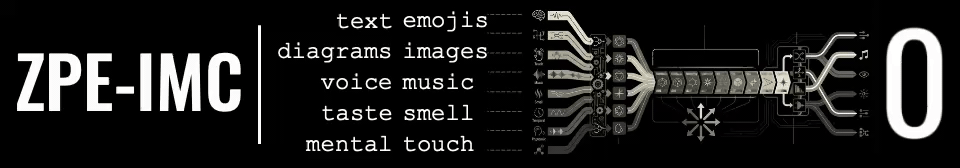

  

# ZPE-Ink

5.590209480060199x structured-tier ratio.

- `.zpink` packet codec.
- >5× compression vs raw float32. Structured-tier round-trip verified. Release surface: `FAIL`.
- Install unit: `code/`.
- Transfer unit: `.zpink` packets.
- Bindings: repo-local sources.
- Authority surface: `proofs/reruns/contradiction_resolution_local/contradiction_resolution_manifest.json`.
- Python 3.11+.
- Rust toolchain.
- `wasm32-unknown-unknown` target.

SAL v6.0 — free below $100M annual revenue. See [LICENSE](LICENSE).

---

## What This Is

ZPE-Ink encodes stylus and pen input into `.zpink` transport packets — **>5× compression vs raw float32** on the structured tier, with full encode/decode parity across Python and Rust/WASM bindings. Swift and C# bindings provide header-level contract validation (magic, version, header size) but do not yet implement payload decode.

If you're building note-taking, annotation, whiteboard, or signature surfaces and need consistent ink-stream encoding: this is that codec. The `.zpink` format is the transport unit. The Python codec is the authority implementation; Rust/WASM provide verified decode parity; Swift/C# provide header interop for format detection.

The repo is a **staged proof surface**. Structured-tier compression passes. Release surface verdict: **FAIL**. Blind-clone verification: **INCONCLUSIVE**. Hard-corpus pass: not closed. This is not a release-ready package.

**Not claimed:** release readiness, blind-clone closure, hard-corpus pass, general digital-ink dominance, or runtime coupling to ZPE-IMC.

| Anchor | Artifact |
|---|---|
| Claim scope map | [`claim_scope_map.json`](proofs/reruns/benchmark_freeze_local/claim_scope_map.json) |
| Contradiction resolution | [`contradiction_resolution_manifest.json`](proofs/reruns/contradiction_resolution_local/contradiction_resolution_manifest.json) |
| Final status | [`FINAL_STATUS.md`](proofs/FINAL_STATUS.md) |

---

Deterministic digital-ink codec centered on the `.zpink` packet format. This repo is a private staging snapshot with a current proof subset and rerun surface. It is not release-ready.

Status in plain language:

- What this is: a staged `.zpink` codec with a Python install surface and repo-local bindings.
- Proven: structured-tier compression exceeds 5x vs raw float32; Python/Rust/WASM decode parity passes locally; Swift/C# header contracts pass.
- Blocked: sovereign release surface is `FAIL` and blind-clone verification is `INCONCLUSIVE`.

Sovereign release surface: `proofs/reruns/contradiction_resolution_local/contradiction_resolution_manifest.json`.

Prereqs for local verification: Python 3.11+, Rust toolchain, and `wasm32-unknown-unknown` target for binding checks.

  

- Deterministic `.zpink` transfer surface.
- Python package under `code/`.
- Rust/WASM/Swift/C# repo-local sources.
- Pip install excludes binding artifacts.

  

<table width="100%" cellpadding="0" cellspacing="0">
  <tr>
    <td width="56%" valign="top">
      <pre><code class="language-bash">python -m venv .venv
source .venv/bin/activate
python -m pip install --upgrade pip
python -m pip install -e './code[dev]'
python -m pytest code/tests -q
python -m zpe_ink demo
python -m zpe_ink verify-roundtrip</code></pre>
      
Authoritative artifact: <code>proofs/reruns/benchmark_freeze_local/claim_scope_map.json</code>

    </td>
    <td width="44%" valign="top">
      <table width="100%" border="1" bordercolor="#b8c0ca" cellpadding="0" cellspacing="0">
        <thead>
          <tr>
            <th align="left">Key coordinates</th>
            <th align="left">Value</th>
          </tr>
        </thead>
        <tbody>
          <tr>
            <td>Repository URL</td>
            <td><code>https://github.com/Zer0pa/ZPE-Ink</code></td>
          </tr>
          <tr>
            <td>Contact</td>
            <td><code>architects@zer0pa.ai</code></td>
          </tr>
          <tr>
            <td>Install unit</td>
            <td><code>code/</code> Python package</td>
          </tr>
          <tr>
            <td>Transfer unit</td>
            <td><code>.zpink</code> packet streams</td>
          </tr>
          <tr>
            <td>Binding packaging</td>
            <td><code>repo-local source surfaces</code></td>
          </tr>
          <tr>
            <td>Current verdict</td>
            <td><code>INCONCLUSIVE</code> (release surface <code>FAIL</code>)</td>
          </tr>
          <tr>
            <td>Claim family</td>
            <td><code>structured-tier-only</code> (&gt;5x vs raw float32)</td>
          </tr>
        </tbody>
      </table>
    </td>
  </tr>
</table>

How to read this table: it reports the latest measured ratios and boundaries; it does not imply release readiness.

<table width="100%" border="1" bordercolor="#b8c0ca" cellpadding="0" cellspacing="0">
  <thead>
    <tr>
      <th align="left">Authority snapshot</th>
      <th align="left">Value</th>
      <th align="left">Evidence</th>
    </tr>
  </thead>
  <tbody>
    <tr><td>Structured tier ratio</td><td><code>5.590209480060199x</code></td><td><code>proofs/reruns/benchmark_freeze_local/baseline_results.json</code></td></tr>
    <tr><td>Structured tier best comparator</td><td><code>brotli 6.825565026256283x</code></td><td><code>proofs/reruns/benchmark_freeze_local/baseline_results.json</code></td></tr>
    <tr><td>Hard corpus ratios</td><td><code>MathWriting 1.0944x</code>, <code>CROHME 1.3015x</code></td><td><code>proofs/reruns/benchmark_freeze_local/baseline_results.json</code></td></tr>
    <tr><td>Release surface</td><td><code>FAIL</code> (handoff <code>NO-GO</code>)</td><td><code>proofs/reruns/contradiction_resolution_local/contradiction_resolution_manifest.json</code></td></tr>
    <tr><td>Blind clone</td><td><code>INCONCLUSIVE</code> (npm probe failure)</td><td><code>proofs/reruns/phase3_external/blind_clone_verdict.json</code></td></tr>
    <tr><td>Non-Latin corpus</td><td><code>Calliar 2.7746x</code></td><td><code>proofs/reruns/phase3_external/calliar_benchmark.json</code></td></tr>
  </tbody>
</table>

How to read this table: these are the current authority anchors; any conflict keeps the repo `INCONCLUSIVE`.

<table width="100%" border="1" bordercolor="#b8c0ca" cellpadding="0" cellspacing="0">
  <thead>
    <tr>
      <th align="left">Proof anchor</th>
      <th align="left">Purpose</th>
      <th align="left">Current truth</th>
    </tr>
  </thead>
  <tbody>
    <tr><td><code>proofs/reruns/contradiction_resolution_local/contradiction_resolution_manifest.json</code></td><td>Sovereign release surface</td><td><code>release_surface_verdict=FAIL</code></td></tr>
    <tr><td><code>proofs/reruns/benchmark_freeze_local/claim_scope_map.json</code></td><td>Claim boundary</td><td><code>structured-tier-only</code></td></tr>
    <tr><td><code>proofs/reruns/benchmark_freeze_local/baseline_results.json</code></td><td>Structured-tier ratios</td><td><code>appendix_all_pass=false</code></td></tr>
    <tr><td><code>proofs/logs/20260321_technical_alignment_cross_runtime.json</code></td><td>Cross-runtime parity log</td><td><code>status=pass</code></td></tr>
    <tr><td><code>proofs/logs/20260321_technical_alignment_binding_contracts.json</code></td><td>Binding contract check</td><td><code>status=PASS</code></td></tr>
    <tr><td><code>proofs/reruns/phase3_external/blind_clone_verdict.json</code></td><td>Blind-clone gate</td><td><code>verdict=INCONCLUSIVE</code></td></tr>
  </tbody>
</table>

  

  

<table width="100%" border="1" bordercolor="#b8c0ca" cellpadding="0" cellspacing="0">
  <thead>
    <tr>
      <th align="left">Surface</th>
      <th align="left">Status</th>
      <th align="left">Evidence</th>
    </tr>
  </thead>
  <tbody>
    <tr><td>Structured-tier transport</td><td><code>PASS</code> (&gt;5x vs raw float32)</td><td><code>proofs/reruns/benchmark_freeze_local/claim_scope_map.json</code></td></tr>
    <tr><td>Hard-corpus transport</td><td><code>FAIL</code> (below best comparators)</td><td><code>proofs/reruns/benchmark_freeze_local/baseline_results.json</code></td></tr>
    <tr><td>Release surface</td><td><code>FAIL</code> / <code>INCONCLUSIVE</code></td><td><code>proofs/INK_WAVE1_RELEASE_READINESS_REPORT.md</code></td></tr>
    <tr><td>Blind clone</td><td><code>INCONCLUSIVE</code></td><td><code>proofs/reruns/phase3_external/blind_clone_verdict.json</code></td></tr>
    <tr><td>Cross-runtime parity (current)</td><td><code>PASS</code></td><td><code>proofs/logs/20260321_technical_alignment_cross_runtime.json</code></td></tr>
    <tr><td>Contract alignment (repo-local)</td><td><code>PASS</code></td><td><code>proofs/logs/20260321_technical_alignment_binding_contracts.json</code></td></tr>
  </tbody>
</table>

  

<table width="100%" border="1" bordercolor="#b8c0ca" cellpadding="0" cellspacing="0">
  <thead>
    <tr>
      <th align="left">Area</th>
      <th align="left">Purpose</th>
    </tr>
  </thead>
  <tbody>
    <tr><td><code>code/</code></td><td>Installable Python package, tests, bindings, scripts</td></tr>
    <tr><td><code>docs/</code></td><td>Architecture, contracts, support, legal boundaries, doc registry</td></tr>
    <tr><td><code>proofs/</code></td><td>Reruns, logs, runbooks, current proof anchors</td></tr>
    <tr><td><code>executable/</code></td><td>Local smoke and verification entry points</td></tr>
  </tbody>
</table>

  

  

Release blockers:

- Sovereign release surface remains <code>FAIL</code> / <code>INCONCLUSIVE</code> while the handoff manifest remains <code>NO-GO</code>.
- UNIPEN access remains unresolved; IAM remains registration-gated; cross-script authority is still restricted to Calliar-only evidence.
- Blind clone is still <code>INCONCLUSIVE</code> until the gate-a resource probe rerun is recorded on the updated code.

Constraints and technical debt:

- Primitive-token branch is candidate-only; Calliar bounded fidelity fails with large Hausdorff error.
- Telemetry reruns are incomplete in this shell without <code>COMET_API_KEY</code> and <code>RUNPOD_API_KEY</code>.

  

<table width="100%" border="1" bordercolor="#b8c0ca" cellpadding="0" cellspacing="0">
  <thead>
    <tr>
      <th align="left">Route</th>
      <th align="left">Target</th>
    </tr>
  </thead>
  <tbody>
    <tr><td>Documentation index</td><td><code>docs/README.md</code></td></tr>
    <tr><td>Auditor path</td><td><code>AUDITOR_PLAYBOOK.md</code></td></tr>
    <tr><td>Governance rules</td><td><code>GOVERNANCE.md</code></td></tr>
    <tr><td>Release gate rules</td><td><code>RELEASING.md</code></td></tr>
    <tr><td>Contribution workflow</td><td><code>CONTRIBUTING.md</code></td></tr>
    <tr><td>Security policy</td><td><code>SECURITY.md</code></td></tr>
    <tr><td>Support routing</td><td><code>docs/SUPPORT.md</code></td></tr>
  </tbody>
</table>

## Ecosystem Cross-Links

- [ZPE-IMC](https://github.com/Zer0pa/ZPE-IMC) — reference repo for shared repo-shape, documentation layout, and workstream-family alignment.
- [Public Benchmark Summary](proofs/artifacts/public_benchmarks/README.md) — current external corpus benchmark surface for this repo.
- [MathWriting Gap Analysis](proofs/artifacts/mathwriting_analysis/README.md) — current hard-corpus diagnosis and the implemented overhead reduction.
