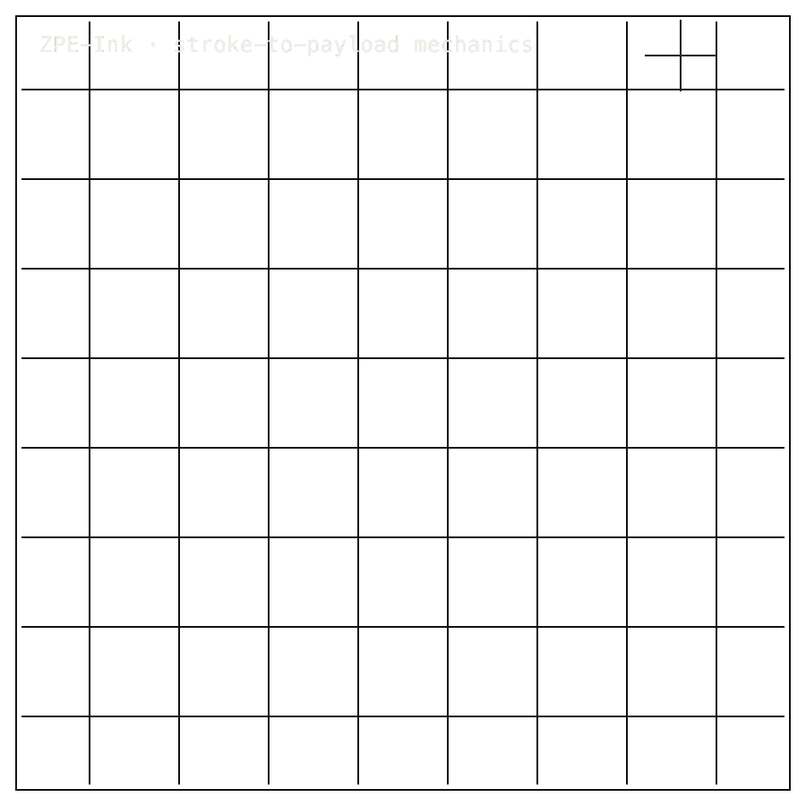

# ZPE-Ink

## Package Install

Installable package: `python3.11 -m pip install zpe-ink`.
Current release: `0.1.1` on [PyPI](https://pypi.org/project/zpe-ink/).
Source: [Zer0pa/ZPE-Ink](https://github.com/Zer0pa/ZPE-Ink/).

```bash
python3.11 -m pip install zpe-ink
```

For full install, smoke, source, and developer commands, [click here](#install-developer-commands-detailed).

---

<table width="100%">
<tr>
<td width="100%" valign="top">
<div><span><b>00 · ZPE-INK</b> · STROKE PROTOCOL</span> <span>RESEARCH-READY · PyPI STALE</span></div>
      <h1>Ink that knows <span>the hand that wrote.</span></h1>
      <p>Stylus stroke codec · ZPE-Ink · PyPI <em>zpe-ink</em> 0.1.1 stale · github.com/Zer0pa/ZPE-Ink</p>
      <p>When a stylus draws, the mark carries more than its shape — it carries the pressure of the hand, the angle of the pen, the rhythm of how it moved. That information has always been in digital ink. It has never had a codec that kept it exactly. ZPE-Ink is a Python <em>.zpink</em> encoder that seals the full stroke — <em>x</em>, <em>y</em>, pressure, tilt, azimuth — and returns it with <strong>0.00 px Hausdorff error</strong> on three public handwriting corpora. The hand's rhythm, kept.</p>
</td>
</tr>
</table>

<table width="100%">
<tr>
<td width="100%" valign="top">
<figure>
        <div></div>
        <figcaption><b>Scope:</b> tested handwriting corpora. Full stylus stroke replay includes x, y, pressure, tilt, and azimuth; PyPI remains stale.</figcaption>
      </figure>
</td>
</tr>
</table>

<table width="100%">
<tr>
<td width="100%" valign="top">
<div><b>01 · THE GAP</b> <span>STORED, NOT KEPT</span></div>
      <h2>Digital ink stores coordinates. It has never had a codec that preserved everything the hand did.</h2>
</td>
</tr>
</table>

<table width="100%">
<tr>
<td width="100%" valign="top">
<div><b>02 · MARKETS</b> <span>ADJACENT FORECASTS</span></div>
      <div>
        <div>
          <div><span>Digital pen / handwriting market</span>  <span>'30 · $5.3B</span></div>
          <div><span>Digital pen</span>  <span>'30 · $7.2B</span></div>
          <div><span>Digital writing instruments</span>  <span>'30 · $6.2B</span></div>
          <div><span>E-learning content tools</span>  <span>'30 · $38.1B</span></div>
          <div><span>Handwriting recognition software</span>  <span>est. $2.1B</span></div>
        </div>
      </div>
      <div>Every stylus that captures a stroke moves through these markets; ZPE-Ink is the exact-geometry record underneath them.</div>
</td>
</tr>
</table>

<table width="100%">
<tr>
<td width="50%" valign="top">
<div><b>03 · VALUE OF MARKET</b></div>
      <div>$6.2<span>B</span></div>
      <div>2030 digital writing instruments; ZPE-Ink is the stroke record three public corpora proved exact.</div>
</td>
<td width="50%" valign="top">
<div><b>04 · INSIGHT</b></div>
      <h2>A signature keeps more than the mark — <span>the hand's rhythm.</span></h2>
</td>
</tr>
</table>

<table width="100%">
<tr>
<td width="50%" valign="top">
<div><b>05.1 · CURRENT TECH</b> <span>STORED AND FLATTENED</span></div>
        <p>A stylus measures pressure and angle dozens of times a second, then a bitmap takes over and flattens the motion into pixels. The hand's rhythm exists in the device for a moment, then disappears into the file.</p>
</td>
<td width="50%" valign="top">
<div><b>05.2 · OUR TECH</b> <span>KEEP THE FULL STROKE</span></div>
        <p>ZPE-Ink keeps the full stroke. It seals <em>x</em>, <em>y</em>, pressure, tilt, and azimuth into a CRC-framed <em>.zpink</em> packet and returns every coordinate unchanged — <strong>0.00 px Hausdorff error</strong> on UJI, CROHME, and DigiLeTs. Zero-channel suppression raises CROHME mean compression from <strong>1.52× to 1.76×</strong> when a device omits tilt. The hand's motion, intact.</p>
</td>
</tr>
</table>

<table width="100%">
<tr>
<td width="100%" valign="top">
<div><b>05.3 · BENCHMARKS</b> <span>PUBLIC CORPUS DATA</span></div>
      <div>
        <div>
          <div><span>UJI</span><b>1.61</b><small>× · 1,364 samples</small></div>
          <div><span>CROHME</span><b>1.44</b><small>× · 90 samples</small></div>
          <div><span>Hausdorff</span><b>0.00</b><small>px</small></div>
          <div><span>CRC</span><b>PASS</b><small>public corpus data</small></div>
        </div>
        <div>
          <div><span>UJI</span>  <span>1.61× PASS</span></div>
          <div><span>CROHME</span>  <span>1.44× PASS</span></div>
          <div><span>DigiLeTs</span>  <span>1.09× PASS</span></div>
        </div>
      </div>
      <div><b>Scope:</b> UJI, CROHME, DigiLeTs, MathWriting, QuickDraw. <strong>IAM/UNIPEN skipped.</strong></div>
</td>
</tr>
</table>

<table width="100%">
<tr>
<td width="34%" valign="top">
<div><b>06 · MEASUREMENT</b> <span>CORPUS CHECK SUITE</span></div>
      <h2>Five public corpora replay with exact geometry. <span>CRC rejects the rest.</span></h2>
</td>
<td width="66%" valign="top">
<div><b>06.1 · COMPARATIVE PERFORMANCE</b> <span>STROKE BYTES PER SAMPLE</span></div>
      <div>
        <div>
          <div><span>.zpink UJI</span>  <span>1.61×</span></div>
          <div><span>.zpink CROHME</span>  <span>1.44×</span></div>
          <div><span>.zpink DigiLeTs</span>  <span>1.09×</span></div>
          <div><span>gzip / zlib aggregate</span>  <span>3.33× / 3.73×</span></div>
        </div>
      </div>
      <div>Same int32 (<em>x</em>, <em>y</em>, pressure, tilt, azimuth) buffer across every corpus. On the QuickDraw plus CROHME aggregate, <strong>.zpink compresses 3.82×, gzip 3.33×, zlib 3.73×</strong>. IAM is registration-limited; UNIPEN is host-unavailable.</div>
</td>
</tr>
</table>

<table width="100%">
<tr>
<td width="100%" valign="top">
<div><b>07 · KEY METRICS</b> <span>MEASURED PUBLIC EVIDENCE</span></div>
</td>
</tr>
</table>

<table width="100%">
<tr>
<td width="100%" valign="top">
<div><b>07.1 · UJI</b></div>
      <div>1.61<span>×</span></div>
      <div>vs raw · <b>1,364 UJI samples</b></div>
</td>
</tr>
</table>

<table width="100%">
<tr>
<td width="100%" valign="top">
<div><b>07.2 · CROHME</b></div>
      <div>1.44<span>×</span></div>
      <div>ICFHR package · <b>90 CROHME samples</b></div>
</td>
</tr>
</table>

<table width="100%">
<tr>
<td width="100%" valign="top">
<div><b>07.3 · DIGILETS</b></div>
      <div>1.09<span>×</span></div>
      <div>real corpus · <b>180 DigiLeTs samples</b></div>
</td>
</tr>
</table>

<table width="100%">
<tr>
<td width="100%" valign="top">
<div><b>07.4 · HAUSDORFF</b></div>
      <div>0.00<span>px</span></div>
      <div>all measured corpora · <b>exact roundtrip</b></div>
</td>
</tr>
</table>

<table width="100%">
<tr>
<td width="100%" valign="top">
<div><b>07.5 · PYPI</b></div>
      <div>v0.1.1</div>
      <div>PyPI stale · <b>next release closes the version skew</b></div>
</td>
</tr>
</table>

<table width="100%">
<tr>
<td width="100%" valign="top">
<div><b>08 · STROKE FIDELITY</b> <span>ENCODE AND DECODE</span></div>
      <h2>A stroke enters. The same stroke exits. <span>0.0 px proves it.</span></h2>
</td>
</tr>
</table>

<table width="100%">
<tr>
<td width="66%" valign="top">
<div><b>08.1 · WHAT THE CODEC KEEPS</b> <span>ALL FIVE CHANNELS</span></div>
      <p>Committed artifacts show bit-exact encode-decode on generated fixtures: int32 (<em>x</em>, <em>y</em>, pressure, tilt, azimuth) buffers seal into a CRC-framed <em>.zpink</em> packet and exit without coordinate change — <strong>0.00 px Hausdorff error</strong> confirmed on UJI, CROHME, DigiLeTs, MathWriting, and QuickDraw. CRC rejects malformed payloads before decode. Zero-channel suppression raises CROHME mean compression from <strong>1.52× to 1.76×</strong> without altering decoded strokes — a device that omits tilt or azimuth gets better compression, not worse. <strong>Non-Python runtime parity is not claimed</strong> beyond static bindings checked across PyO3, WASM, Swift, and C#.</p>
</td>
<td width="34%" valign="top">
<div><b>08.2 · HONEST BLOCKER</b></div>
      <span>Honest Blocker ·</span>
      <p>Three checks remain open: cutting the next release, passing the harder IAM and UNIPEN corpora (IAM is registration-limited, UNIPEN is host-unavailable), and proving a clean-room rebuild from spec. Today the PyPI package at <strong>0.1.1</strong> sits ahead of its bindings and runtime at <strong>0.1.0</strong> — a version skew the next release closes.</p>
</td>
</tr>
</table>

<table width="100%">
<tr>
<td width="33%" valign="top">
<div><b>09</b> </div>
      <h2>INK THAT KEEPS <span>THE HAND.</span></h2>
</td>
<td width="67%" valign="top">
<div><b>09.1 · THE AMBITION</b></div>
      <p>The aim is a stroke record that travels — from a tablet to a server to a researcher's workstation to another device entirely — without losing the pressure, the angle, or the rhythm that made the mark a particular person's. Handwriting becomes citable data, not a frozen picture of itself, across the platforms where pens actually write.</p>
</td>
</tr>
</table>

<table width="100%">
<tr>
<td width="33%" valign="top">
<div><b>09.2 · WHAT WORKS NOW</b></div>
        <h2>Working today: 0.00 px Hausdorff error on UJI, CROHME, and DigiLeTs; CRC framing confirmed.</h2>
</td>
<td width="67%" valign="top">
<div><b>09.3 · WHAT'S STILL OPEN</b></div>
        <h2>Open: PyPI 0.1.2 release, hard-corpus pass on IAM and UNIPEN, blind-clone closure, shipped runtime parity.</h2>
</td>
</tr>
</table>

<table width="100%">
<tr>
<td width="100%" valign="top">
<div><b>09.4</b> &middot; EDUCATION · NEAR-TERM (12–24 MO)</div>
      <div>Student handwriting survives the upload</div><div>An e-learning platform that stores a million pages of student maths working can keep the hand that wrote them — pressure, hesitation, retraced strokes — not a flattened image. A teacher reviewing late work sees the thinking, not the result.</div>
</td>
</tr>
</table>

<table width="100%">
<tr>
<td width="100%" valign="top">
<div><b>09.5</b> &middot; SIGNATURES · NEAR-TERM (12–24 MO)</div>
      <div>A signature carries the hand</div><div>A bank or notary capturing a signature on a tablet can archive the full stroke dynamics, not a glyph image. Forensic comparison stops being a visual judgment about pixels and becomes a measurable comparison of pressure curves and pen angles across signings.</div>
</td>
</tr>
</table>

<table width="100%">
<tr>
<td width="100%" valign="top">
<div><b>09.6</b> &middot; STYLUS PLATFORMS · MID-TERM (24–48 MO)</div>
      <div>One stroke packet across devices</div><div>A stylus drawing made on an iPad reaches a Windows tablet, a web canvas, and an Android phone without a conversion step that drops tilt or smooths pressure. The note-taking app stops choosing between portability and fidelity.</div>
</td>
</tr>
</table>

<table width="100%">
<tr>
<td width="100%" valign="top">
<div><b>09.7</b> &middot; RESEARCH ARCHIVES · MID-TERM (24–48 MO)</div>
      <div>Handwriting corpora become jointly searchable</div><div>UJI, CROHME, DigiLeTs, and any future corpus on the same exact-geometry codec can be queried as one. A handwriting researcher hunting for a specific letter formation stops running three retrieval pipelines and starts asking one question of one archive.</div>
</td>
</tr>
</table>

<table width="100%">
<tr>
<td width="100%" valign="top">
<div><b>09.8</b> &middot; ARCHIVE STANDARD · PARADIGM (48 MO+)</div>
      <div>Pen computing acquires a common record</div><div>Notes, signatures, sketches, maths, and annotations from any device resolve to the same kind of stroke record. A handwritten archive becomes a citable, retrievable substrate — the way text and code already are — instead of a folder of frozen images that lose the hand.</div>
</td>
</tr>
</table>

---

<a id="install-developer-commands-detailed"></a>

## Install / Developer Commands Detailed

<!-- INSTALL-DX:START -->
#### Package Install

Installable package: `python3.11 -m pip install zpe-ink`.
Current release: `0.1.1` on [PyPI](https://pypi.org/project/zpe-ink/).
Source: [Zer0pa/ZPE-Ink](https://github.com/Zer0pa/ZPE-Ink/).

```bash
python3.11 -m pip install zpe-ink
```

Import smoke:

```bash
python3.11 - <<'PY'
import importlib.metadata as md
import zpe_ink

print("zpe-ink", md.version("zpe-ink"))
PY
```


CLI smoke:

```bash
zpe-ink --help
zpe-ink-demo --help
zpe-ink-verify-roundtrip --help
```

Install success only proves package acquisition/import. Product scope, stale PyPI state, platform limits, and blockers remain in the front-door sections below.
- Version skew exists: root manifest is 0.1.1 while code/native manifests still carry 0.1.0; align before publishing again.
<!-- INSTALL-DX:END -->

#### Quick Start

Development install:

```bash
python -m venv .venv
source .venv/bin/activate
python -m pip install --upgrade pip
python -m pip install -e './code[dev]'
python -m pytest code/tests -q
python -m zpe_ink demo
python -m zpe_ink verify-roundtrip
```

Package build:

```bash
python -m build
```
